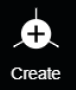

# Create

Under Create, users are able to create a vertex anywhere within the point cloud. If two vertices are created, then a connecting edge will also form between those 2 vertices. Users can either click the Create button, in the upper toolbar of the 3D window, or the hotkey can be used. \
\
If the Create button is used, then a new vertex will be created after each left-click of the mouse. Right-click anywhere in the 3D window to end the line of created vertices/edges. \*\*The Create function will still be active. If left-click is used again, then another string of vertices/edges will begin.&#x20;

To get out of Create mode completely, hit Alt or Shift. The tool will revert back to [Modify](modify.md) mode.

To use the hotkey: Hold Alt + left-click anywhere on the point cloud to create a vertex. While continuing to hold Alt, drag the mouse to another location and left-click on the point cloud again. This creates another vertex and a connecting edge between the two vertices. New vertices/edges will continue to be created as long as the hotkey is being executed. To end the connection, right-click anywhere in the 3D window. When Alt is released, the tool will default back to Modify mode.&#x20;


[Snap mode](../../advanced-function/snap-mode.md) also affects the location, and placement, when creating vertices.&#x20;



Create only works when the tool is in [Vertex mode](../../mode.md). Nothing will be created when the tool is in [Surface mode](../../mode.md).

