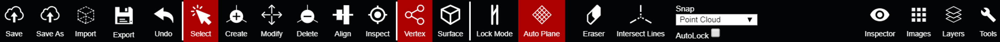

# Introduction

This user guide aims to be a comprehensive guide to the `Pointivo Wireframe Tool`.  
It contains the full documentation for `Pointivo Viewer v780`.

## What is in this docummentation

There are several parts in this user guide.

> [Basic Function](basic-function/) includes all of the basic functions in the tool.

> [Mode](mode/) includes the different functions related to the surfaces and wireframe.

> [Advanced Function](advanced-function/) gives a detailed explanation of the advanced functions.

> [Inspector](properties/), [Images](images.md), [Layers](layers/), and [Tools](tools/) provide the controls to edit and view the parameters and annotations of a wireframe.

> [Settings](settings.md) is the panel in the top right corner.

> [Special Cases](special-cases/) shows you how to deal with various difficult cases you may encounter during your experience.
>
> [Resources](resources/) has some external files for your reference.
>
> [Weekly Updates](weekly-updates/) The updates per week.
>
> [Deprecated](deprecated/) Recycle Bin

## Help and Support

We are passionate about this technology and even more passionate talking about it. If you’re interested in what we are doing, think it’s cool, or have an idea to give our technology the ability to see through walls, then please feel free to [reach out](http://pointivo.com/contact/).

## Contact Info

3400 Peachtree Rd NE, Atlanta, GA 30326, Suite 700 \(678\) 801-6223  
team@pointivo.com

