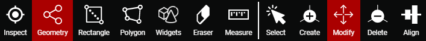
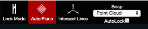
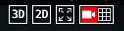
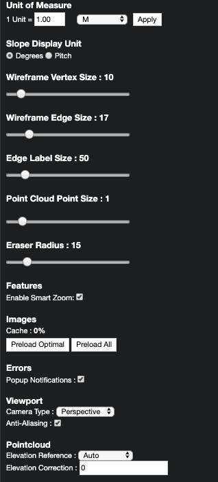

# Introduction

This user guide aims to be a comprehensive guide to the `Pointivo Wireframe Tool`.

## What is in this documentation?

### **There are several sections within this user guide.**

[Basic Functions](basic-function/) provides a breakdown of all of the basic functions in the tool:

[3D Scene Manipulation Tools](3d-scene-manipulation-tools/) include all of the necessary tools to create and alter a wireframe:

[Mode](mode.md) describes the two main settings/modes for wireframing: Vertex Mode and Surface Mode.

[Advanced Functions](advanced-function/) gives a detailed explanation of the advanced functions.

[Inspector](properties.md), [Images](images.md), [Layers](layers/), and [Tools](tools/) provide the controls to edit and view the parameters and annotations of a wireframe.

The [Preset & Projection View](preset-and-projection-view.md) buttons allow users to control the viewport's dimension and camera type settings.

The [View Cube](view-cube.md) is the compass of the 3D viewport.

[Settings](settings.md) is hidden in the little grey gear at the top right corner of the screen.

[Special Cases](special-cases/) demonstrates how to deal with various difficult scenarios you may encounter during your project experience.

[Resources](resources/) has some external files for your reference.

[Deprecated]() Recycle Bin

