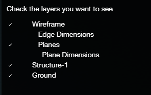

# Advanced Function

## Register Wireframe:

1. When the imported wireframe is not covered on the point cloud \(because of different coordinates\), this feature can be used to move and rotate the wireframe.
2. Create a new edge from the imported wireframe to the same point in the point cloud. Then Adjust the endpoint to make sure it is in the accurate location.
3. Repeat Step 2 based on different points, until there are 4 new edges.

   

4. Hold `Ctrl` to select all the 4 edges and click Register Wireframe.

## Properties:

1. After the rough wireframe, click [Detect Edge Types](../tools/#detect-edge-types) to auto assign the edge type into all the edges.
2. To manually add the Property into the edges, go to the Properties tab, select the edge, click the Edge Type from the Add Property dropdown menu. Then select the Edge Type whichever you want.
3. To change the Edge Type of the edge has already been assigned, go to the Properties tab, and select the Edge Type from the dropdown menu.

## Layers:

You could turn on and off the different layers.

Wireframe: The entire wireframe including all the dimensions and planes. Edge Dimensions: The measurements of the edges. Planes: The green shade of the detected planes. Plane Dimensions: The SurfaceArea/Perimeter/Pitch of each plane. Camera: All the cameras captured in the scene. Structure-1: The point cloud of the different structures. Ground: The point cloud of the ground.

## Adjust Vertices:

Open Adjust Vertices panel and click the vertex you would like to adjust.

1. 1 Image + Locked Plane: You should Lock a plane first, if you would like to change the Triangulation to this mode. Under this mode, only 1 image is needed to adjust the vertex. And the vertex will fixed on the locked plane and change its location based on the 2D target you select.
2. 2 Images: The default triangulation is 2 Images, you could change the location of the vertices on two images to adjust the vertex. The vertex location will be projected on the third image at the same time. Remember to `Scroll` the images to find the best one.
3. 3 Images: It is going to use all the three images to project the vertex location in the 3D view. And the vertex location can be seen on any other images if you Scroll the images. But this mode is only used on the Accuracy Study or when the projection error is big.

Besides, if you Drag the vertex on 3D view, the projected location will be changed at the same time on 2D view. After the adjustment, use the Apply button to implement your adjustment and the verified vertex is going to turn from Red to Green.

