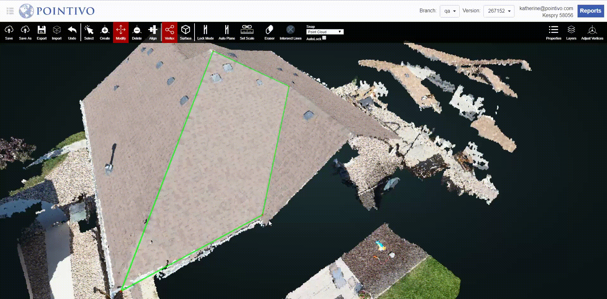

# Auto Plane

When Auto Plane is on, all of the vertices that satisfy the planar constraint of angle threshold will be detected as a plane. When Auto Plane is off, planes will no longer be automatically detected. This mode is turned on by default.

