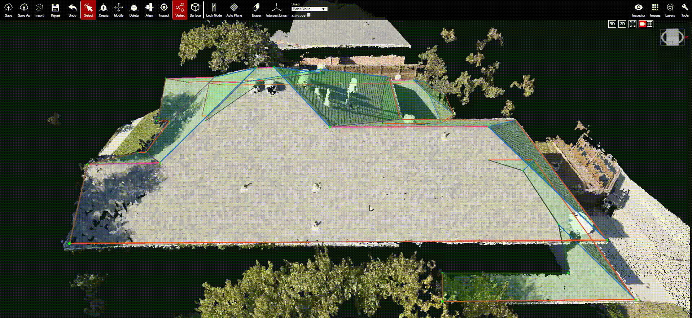

# Auto Plane

When Auto Plane is on, all of the vertices that satisfy the planar constraint of angle threshold will be detected as a plane. When Auto Plane is off, planes will no longer be automatically detected. This mode is turned on by default.

The existing geometry in the video is not detected because Auto Plane is turned off. Once Auto Plane is turned on, the geometry is then automatically detected as a plane.

