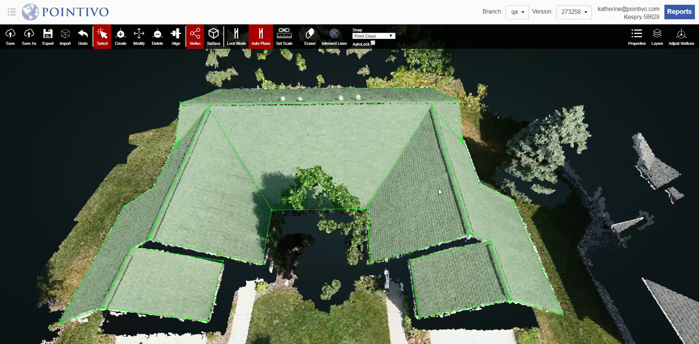

# AutoLock

When you first open a project, Autolock is turned off by default. It will be turned on automatically after Plane Sort is completed.

When AutoLock is turned on, each time you select a vertex in 3D, the biggest plane that the selected vertex belongs to will be locked. The triangulation mode will switch to 1 Image + Locked Plane.

This feature is very convenient since it requires you to adjust each vertex in only one of the 2D images.


UPDATED VIDEO COMING SOON



When using AutoLock to adjust a vertex, you need to make sure that the plane is accurate first.


Once you select Plane Sort, in [Adjust Vertices](../adjust-vertices/), you can either click on a vertex within the 3D view or click on the vertex ID in the [Adjust Vertices](../adjust-vertices/) list to select a vertex and automatically lock the largest plane that the selected vertex is on. 

In order to get out of Auto Lock mode, you must uncheck the box next to Auto Lock, underneath the Snap drop-down menu in the top toolbar of the 3D tool.

