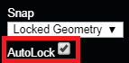

# AutoLock

When a project is first opened, Autolock is turned off by default. Users can manually turn Autolock on by clicking the white box, or it will automatically turn on after Plane Sort is completed.

When AutoLock is turned on, each time a vertex is selected in 3D, the biggest plane that the selected vertex belongs to will be locked. The triangulation mode will switch to 1 Image + Locked Plane.

This feature is very convenient since it allows users to adjust each vertex in only one of the 2D images, and have it reflected in the other two 2D images.


When using AutoLock to adjust a vertex, make sure that the plane is accurate first.


Once Plane Sort is selected in [Adjust Vertices](../tools/adjust-vertices/), users can either click on a vertex within the 3D view or click on the vertex ID in the [Adjust Vertices](../tools/adjust-vertices/) list to select a vertex and automatically lock the largest plane that the selected vertex is on. 

In order to get out of AutoLock mode, the box next to AutoLock must be manually unchecked.

