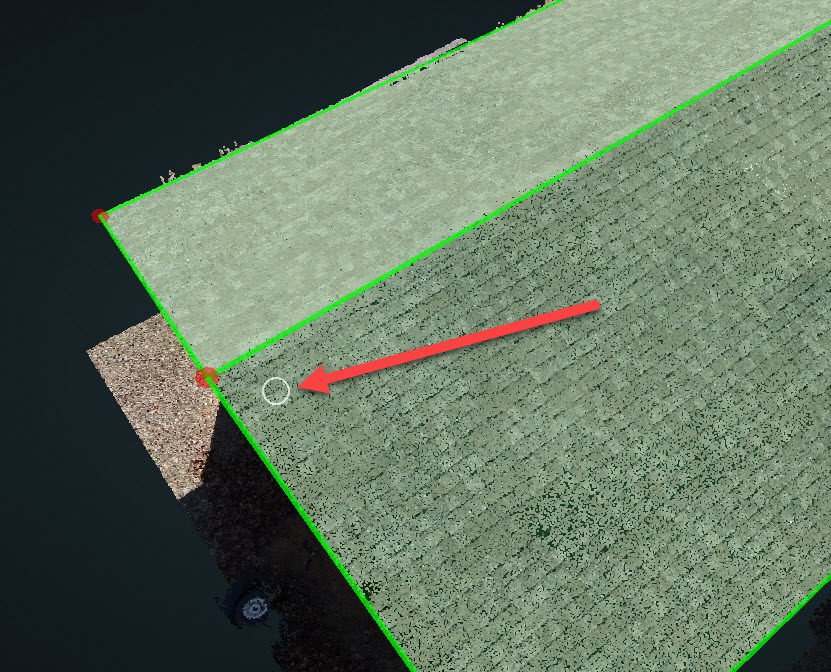

# Eraser

Click Eraser, then left-click\(hold\) and drag the mouse on the wireframe to erase the nearby vertices. A white region of interest circle will appear while clicking and dragging the mouse, any vertex underneath it will be erased.

  

