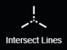
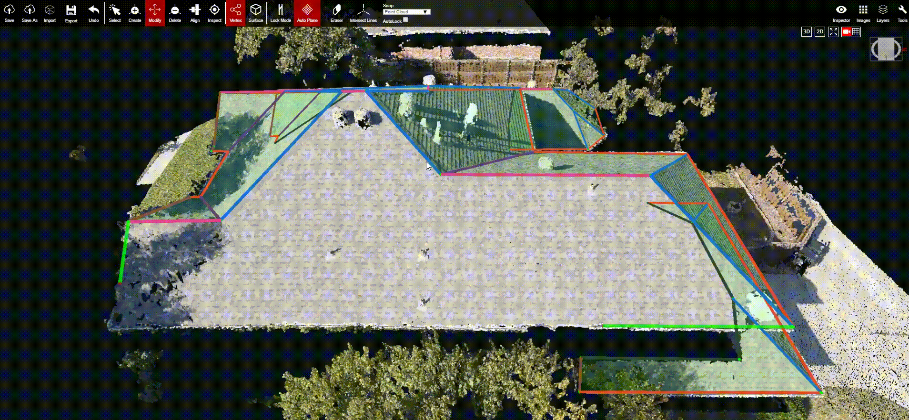

# Intersect Lines

Intersect Lines can be used when a surface of the roof is too broken, or noisy, to fully create a plane. If there is a broken corner of a surface, but the two edges leading to that corner are partially created, then Intersect Lines can be used to connect those partial edges. The video at the bottom of this page demonstrates the Intersect Lines function.

If there isn't a way to create two partial edges leading to the broken corner, then the plane can still be closed off without using Intersect Lines. Connect the two vertices that would lead to the missing corner so that the plane becomes complete. Once the plane is fully enclosed, lock the surface, add an extra vertex to the new edge, and then drag that vertex out to the missing corner. 

1. Click Intersect Lines, and select the two edges that will intersect.
2. The two edges will extend and intersect each other at a newly created vertex.


Keep in mind that the newly created intersecting vertex may not be the accurate location of that vertex and it will still need to be verified and adjusted in [Adjust Vertices](../tools/adjust-vertices/).


