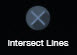
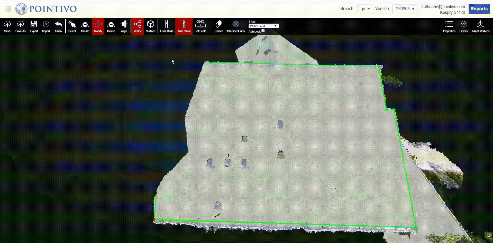

# Intersect Lines

1. Click Intersect Lines, and select the two edges you would like to intersect.
2. The two edges will extend and intersect each other to form one vertex.


Keep in mind that the intersecting vertex, that is created from using Intersect Lines, may not be the accurate location of that vertex and it will still need to be verified and adjusted in [Adjust Vertices](../adjust-vertices/).


