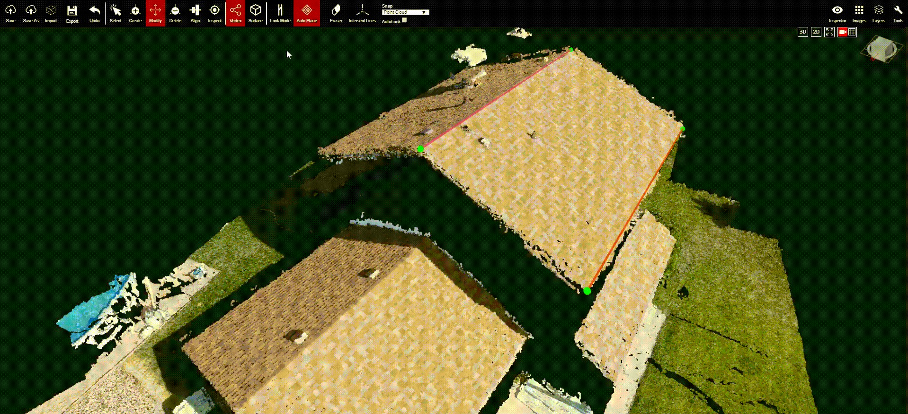
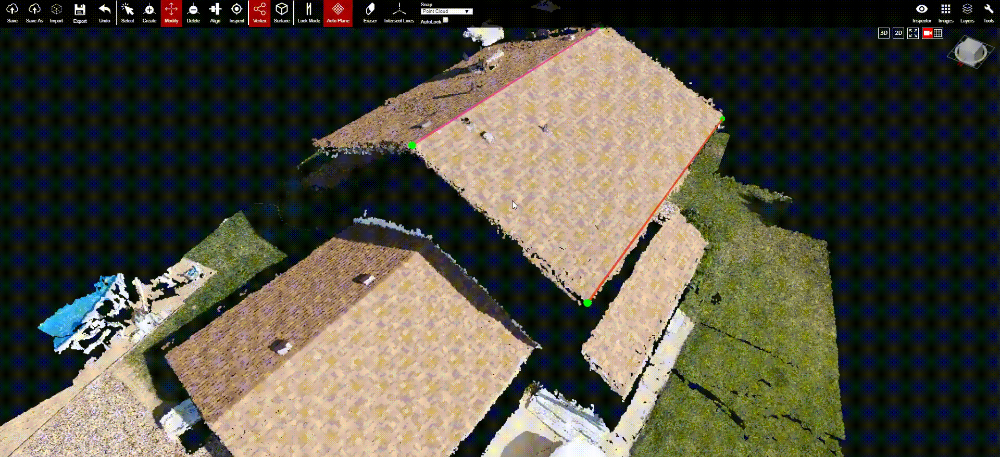

# Lock Mode

## Lock Mode - Edge

1. Under [Modify](../basic-function/modify.md) and [Vertex Mode](../mode/vertex-mode.md), select an edge for the vertices to lock onto and press `Space` to lock the edge.
2. Under [Modify](../basic-function/modify.md) and [Vertex Mode](../mode/vertex-mode.md), Click and Drag a vertex in the 3D tool. 
3. When Lock Mode is off \(default\), the vertex can be only moved on the locked edge.
4. When Lock Mode is on, the vertex can be only moved in a parallel direction to the locked edge.

In the video above, Lock Mode is off \(default\) and one of the edges is locked. The selected vertex snaps to the locked edge when the user modifies it. The vertex can only move in the direction of the locked edge.

In the above video, Lock Mode is on and one of the edges is locked. When the vertex is modified it moves in the parallel direction of the locked edge. The vertex can be placed anywhere on the point cloud but once an edge is locked, and Lock Mode is turned on, the vertex will only move in a parallel direction to the locked edge.

## Lock Mode - Surface

1. Under [Modify](../basic-function/modify.md) and [Surface Mode](../mode/surface-mode.md), select a plane to lock a vertex onto and press `Space` to lock the plane.
2. Under [Modify](../basic-function/modify.md) and [Vertex Mode](../mode/vertex-mode.md), Hold and Drag the vertex in the 3D tool. 
3. When Lock Mode is off \(default\). The vertex can be only moved on the locked plane.
4. When Lock Mode is on. The vertex can be only moved in a parallel/co-planar direction to the locked plane.

In the video above, Lock Mode is off \(default\) and one of the planes is locked. The selected vertex snaps to the locked plane when you modify it. The vertex can only be moved in the direction of the locked plane.

In the above video, Lock Mode is on and one of the planes is locked. When you the vertex is modified it moves in the parallel direction of the locked plane. Users can put the vertex anywhere on the point cloud but once a plane is locked, and Lock Mode is turned on, the vertex will only move in a parallel/co-planar direction to the locked plane.

