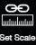

# Set Scale


This feature is not working anymore. Under construction.


1. Click Set Scale and then select any line that you know the measurements.
2. If you want to change the unit, click the dropdown menu to transform between M, FT, FFI and Unitless. If you want to scale the point cloud, change the unit first and input the new length.
3. After clicking Apply, if you turn on the Edge Dimensions layer, you will notice that all of the measurements have been changed to the new scale setting.

