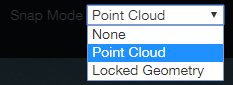

# Snap Mode

## None:

All of the movements will be fixed on the XY plane in the current view. You are not able to make changes on the Z axis unless you rotate the point cloud to change your point of view.

## Point Cloud:

The selected vertex will be dropped onto the nearest point in the point cloud. You will not be able to place a vertex in the black area of the viewport where there is no point cloud.

## Locked Geometry:

This mode is only active, and automatically activated, when a plane is locked. All movements will be fixed on the locked plane, or will be fixed on the co-planar of the locked plane.

