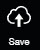
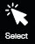
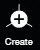
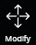

# Basic Function

## Save：

Save the current wireframe into the working branch, generate a new sequential version number, and also save a wireframe.json under s3://pointivo-projects/ProjectID/out/WIREFRAME

## Save As：

Save the current wireframe into the other branch if you change or type the Tag name, generate a new sequential version number, and also save a wireframe.json under s3://pointivo-projects/ProjectID/out/WIREFRAME

Name: Typically empty but the content will be stored in the database. Description: Typically empty but the content will be stored in the database. Tag: The branch this wireframe going to be stored in. Mark as Done?: Mark it when you finish the project. It will open the latest version of wireframe when the next time you open the project.

## Export：

Export the current wireframe into local computer.

## Import：

Import the previous exported wireframe.

## Undo：

Undo the last operation. Notes: Some operation may not be undo properly, like [Attach](../tools/#attach)/[Detect Cutouts](../tools/#detect-cutouts).

## Select：

Under Select mode, you can rotate/pan the entire model. All the objects could be selected but could not be modified. This is the Read Only mode for demo.

## Create：

Under Create mode, it will create a vertex in the location where you clicked.

## Modify：

Under Select mode, you can rotate/pan the entire model. All the objects could be selected and modified if you hold the mouse and drag.

## Delete：

Under Delete mode, it will delete the vertex you selected. [Eraser](../advanced-function/#eraser) and [Erase All](../advanced-function/#erase-all) are the other functions could help you delete multiply vertices.

## Align:

1. \(Optional\) Under [Modify](./#modify) and [Surface Mode](../mode/#surface-mode), select a plane which you would like the edge to fix in and press `Space` to lock it.
2. Under [Modify](./#modify) and [Vertex Mode](../mode/#vertex-mode), select \(or Hold `Ctrl` to multiply select the lines\) you want to align with.
3. Click [Align](./#align) or press `Shift` to change to [Align](./#align) mode, and click the Target edge.
4. The edges you selected on Step 2 will be aligned with the Target you selected on Step 3 and fixed in the plane you selected on Step 1.

