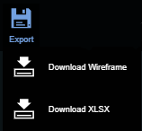
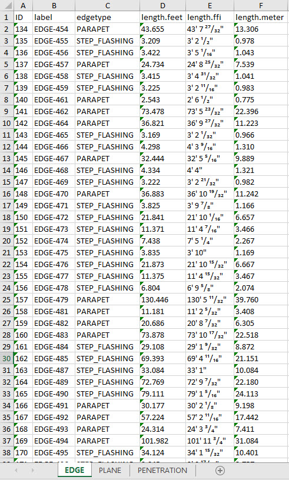

# Export



Exports the current wireframe.json onto the local computer. This is the file users will import to continue your work on a disrupted project, or to register the wireframe onto a duplicate point cloud.



Exports the current wireframe.xlsx onto the local computer.

All of the Edge/Plane/Penetration information is stored in this .xlsx file via different unit types. 



