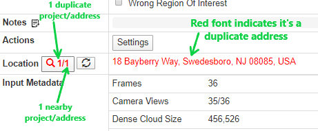

# Import

Click Import to upload a previously exported wireframe into a project.

Import is mainly used when dealing with duplicate projects. When a project is a duplicate, there will always be an original project that was previously wireframed. The wireframe.json file can be exported from that original project, and imported into the new/duplicate project. Once the original wireframe.json file is imported into the duplicate project, the wireframe will need to be [registered ](https://pointivo.gitbook.io/user-guide/tools/wireframe-tools/register-wireframe)onto the duplicate's point cloud.

Import can also be used to salvage a wireframe when there are errors in the tool that won't allow the wireframe to be saved. The user can export the wireframe, while still inside the project, then close the project or refresh the window. When the project reloads, the wireframe can be imported back into the project and the user won't lose any work.

### How to notice a duplicate project, and locate the original:

Watch the video below for instructions on using the Location button to find the original:


This video is also linked in Notion [here](https://www.notion.so/pointivo/How-to-more-easily-find-duplicate-projects-170c2129d7a64ed3b090f0f6d456f169)


* Duplicate projects will have the address in red font, instead of black, in the Location section on the intranet.
  *   The Location button will also have red font, and it will have numbers like 1/1 or 1/2. These numbers denote how many duplicate projects there are with the same address, and how many with nearby addresses.

* Users can also try copying the address from the Location section, and pasting it into the Address column of the intranet. This will bring up all of the projects with that address, and the original project's wireframe.json can be exported from there.
