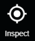
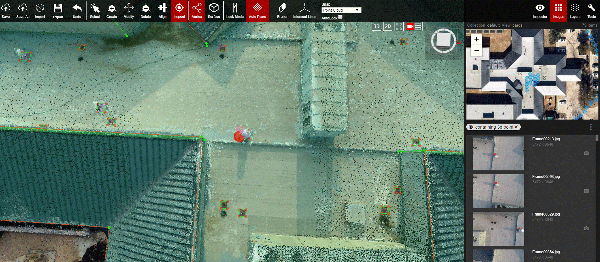

# Inspect

  
With the Images panel open click on Inspect, then click anywhere on the point cloud and all of the cameras and 2D images for that area will load up in the Images panel. This function is meant to be used for 2D Annotation purposes.


Video coming soon!


