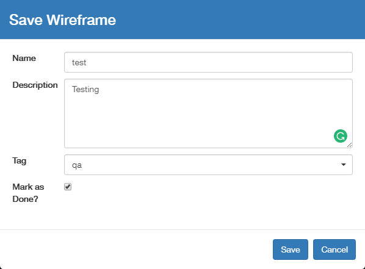

# Save As

This will save the current wireframe into another branch if you switch to, or create, a different Tag name. It will generate a new sequential version number, and it also saves a wireframe.json under s3://pointivo-projects/ProjectID/out/WIREFRAME



Typically empty but the content will be stored in the database.



Typically empty but the content will be stored in the database.



The branch that this version of the wireframe will be stored in.



Check this box when you finish the project. It will open the latest saved version of the wireframe the next time you open the project.



