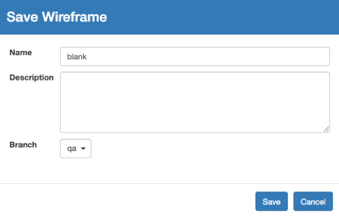

# Save & Save As

Saves the current wireframe into the working qa branch, generates a new sequential version number, and also saves a wireframe.json under s3://pointivo-projects/ProjectID/out/WIREFRAME

Save As will save the current wireframe into another branch if you switch to, or create, a different Tag name. It will generate a new sequential version number, and it also saves a wireframe.json under s3://pointivo-projects/ProjectID/out/WIREFRAME

