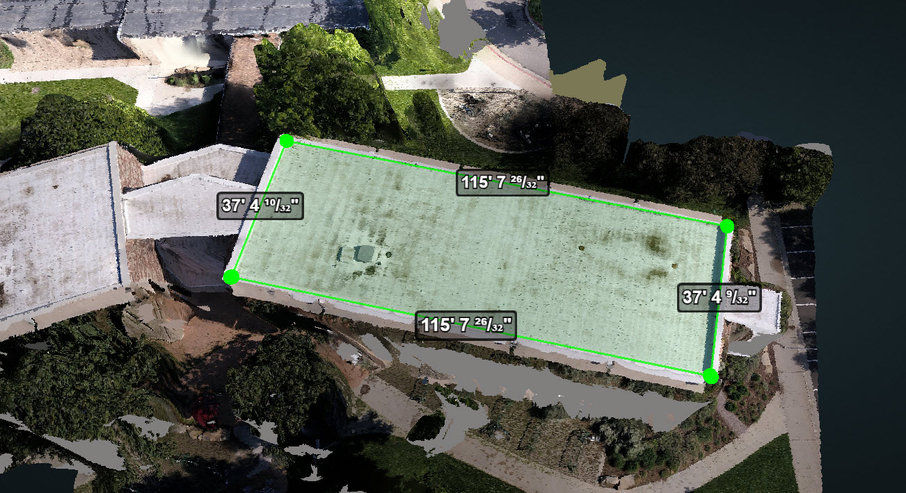
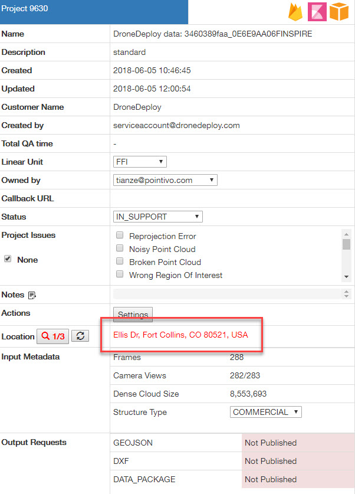
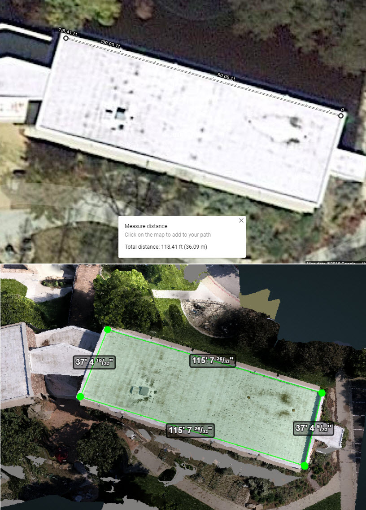

# Scaling Check

**Steps to check the scaling issue using GoogleMap**

Every time we receive a **DroneDeploy Standard** project, we would need to check whether the scaling is correct or not first before actually QA the project.

1. Take `9630` as an example, when it becomes `IN_QA`, open the project and create the start&end vertex on a long and clear edge in 3D. Adjust the vertices to get the measurement. 
2. Find the address of the project from Intranet and click that address to go to Google Map. 
3. Measure the same edge or area in GoogleMap, remember to turn off the 3D Mesh before you do the measurements. 

4. Compare the two measurements and if the difference is more than 6 inches, change the project to `IN_REVIEW` and let us know on the wireframe channel with the compared picture. 
5. If the two measurements match with each other, then it is good to QA.

