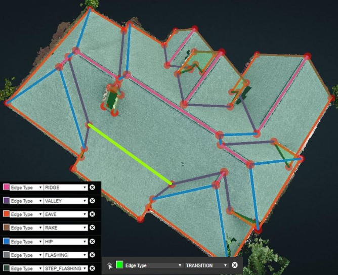
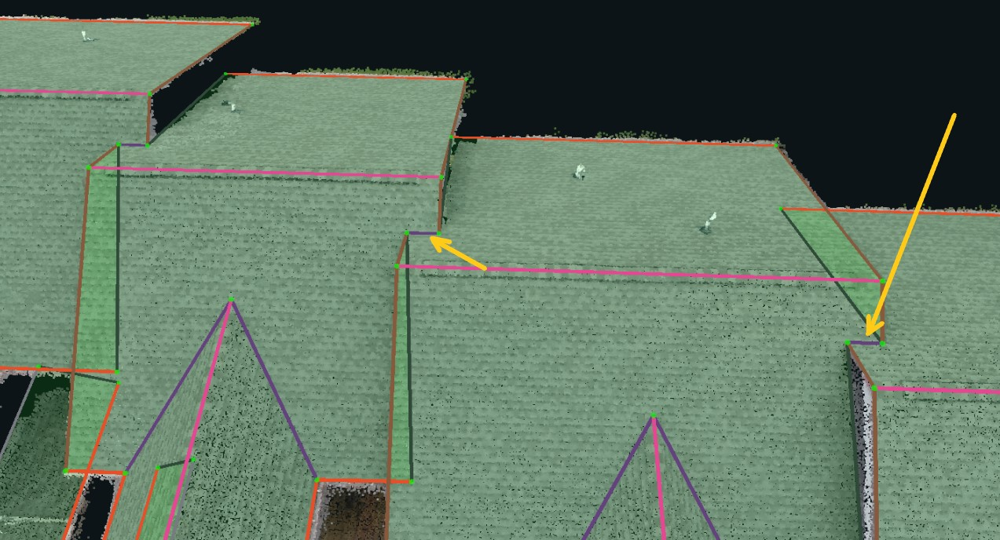
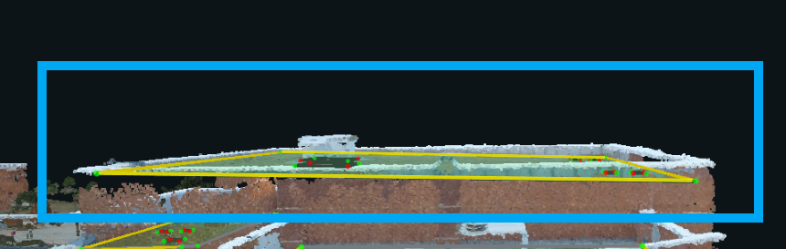
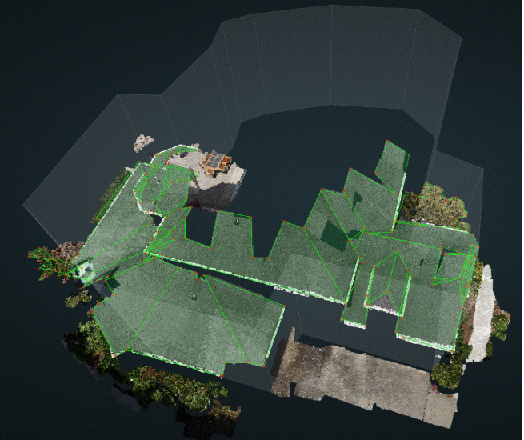

# Edge Types & Requirements


For information on the how to change edge types, and view all of a specific type at once, please refer to the [Edges panel](edges.md) section of the User Guide.


**Common Edge Types**

|  | Number of Planes | Angle | Parallel to Ground |
| :--- | :--- | :--- | :--- |
| Eave | 1 |  | √ |
| Rake | 1 |  | × |
| Hip | 2 | "Λ" | × |
| Valley | 2 | "V" | × |
| Ridge | 2 |  | √ |
| Flashing | Must be against a wall or chimney | × | √ |
| Step Flashing | Must be against a wall or chimney | √ | × |
| Parapet | Only on flat roofs that are surrounded by, and enclosed in, a low wall/ledge | × | √ |
| Transition | 2 \(This is an edge that represents a pitch change. It will always be parallel to the ground and will be at the intersection of 2 planes, where one plane is above it and the other is below it\) | × | √ |

**Edge Type Example - QA Project: 6573**

## Special Cases

### Valleys

Although these edges appear parallel to ground, in reality they are slightly sloped to prevent rain water from getting stuck. Therefore, they are Valleys instead of Transitions. Another way to know that these are not transition edges is that a transition edge is parallel to ground with one plane above it and one plane below it. These valley edges have both connected planes above them, so they can't be transitions.

### Parapets

Usually we define a parapet edge as being parallel to ground and surrounded by a parapet wall. However, for cases like the structure above all edges would be Parapets. The 2 sloped edges are only slightly angled and the roof plane is all surrounded by a parapet wall.

### Problem POINT\_DENSE

For point clouds that are broken enough to be classified as a Problem POINT\_DENSE, the edges of the wireframe should be extended as far as is visible in the 2D images. Edge types should be assigned based on the 2D images. However, do not spend too much time on this. If the images do not extend far enough to see how the edge type ends, then leave the default edge assignment from Detect Edge Types.

The two hip edges, circled below, were visible in the 2D images and manually assigned as hips. If the end points were not visible in the images, then the wireframe would cut off where the point cloud ends and the edges would turn into rakes instead of hips.

### Unusable POINT\_DENSE

For point clouds that are broken enough to be classified as an Unusable POINT\_DENSE, the edges of the wireframe should cut off wherever the point cloud is broken. Most of the time, autogen will automatically cover the broken structure. Occasionally the autogen will be on the ground or trees, or non-existant, instead of on the roof. In that case, users would just put a single plane on any portion of the roof.

Regardless of autogen's success, Unusable POINT\_DENSE projects Do Not need edge types assigned at all. Save the single plane, or autogen, wireframe, generate the resources, set the point\_dense to unusable and the project issues to Broken Point Cloud, and publish the project. The example below shows an unusable point\_dense with the autogen wireframe saved on it.

