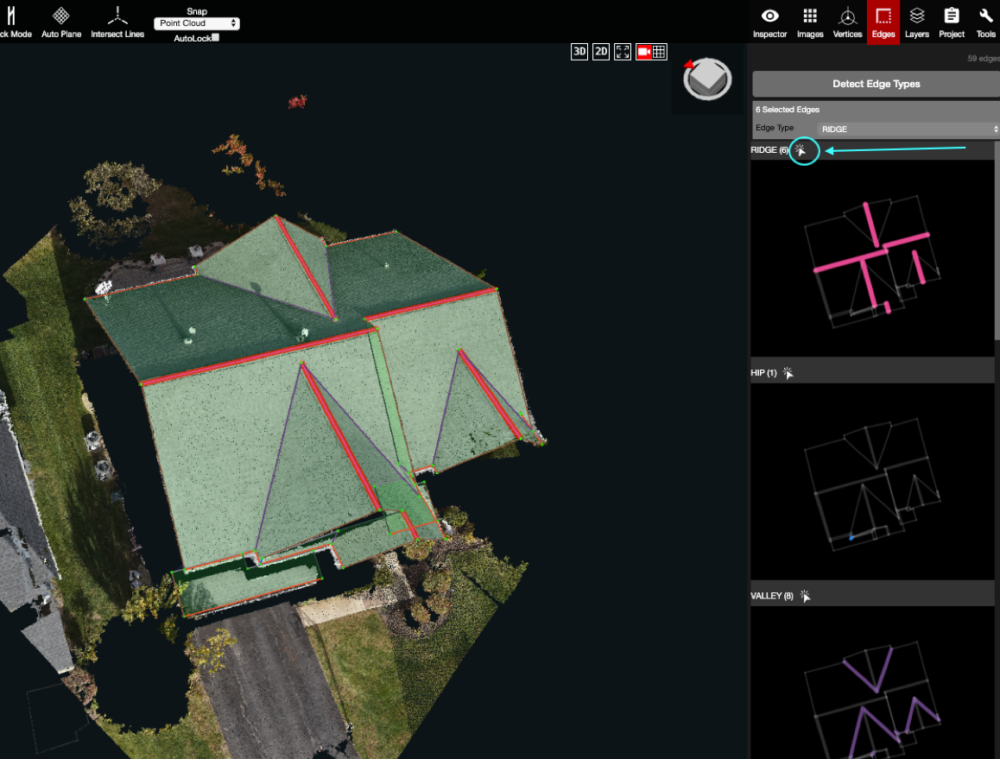

# Edges

The Edges panel is used to detect, assign, and change edge types. Within the panel, there is a window for each different edge type. Edges can be individually changed, within those windows, by selecting an edge and changing the type in the dropdown menu at the top of the Edges panel. 

Clicking on the little white arrow \(blue circle in the image below\) will select all of the edges for that given edge type. This is a quick way to check that all of those selected edges are correctly assigned, and is also a way to change all of them to a different type simultaneously.

