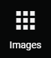
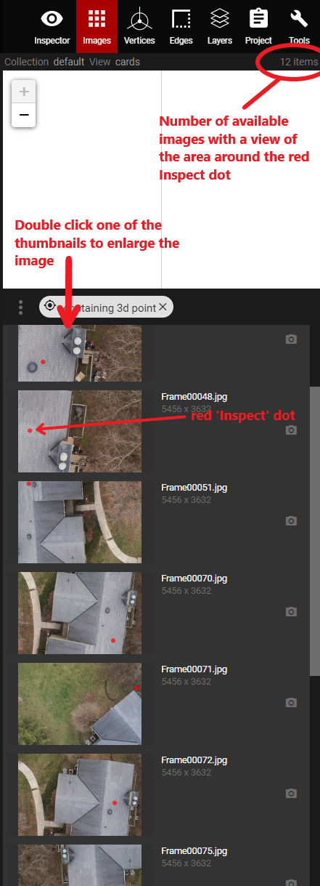

# Images

The Images panel contains all of the 2D images available for a given project. In the upper right corner of the Images panel, there will be a number of items listed \(shown in the example below\). This number signifies the total number of images available for the structure. Users can scroll through all of them and double click on one to expand it. Once expanded, the image can be zoomed in and out and users can pan around it to view all areas of the image. 

A more efficient way to use this panel, is to use it in conjunction with the [Inspect ](3d-scene-manipulation-tools/inspect.md)tool. When the Images panel is opened, and Inspect has been used to select a spot on the point cloud, users will see all of the 2D images that have a view of the inspected location.  The number of items, in the upper right corner of the Images panel, will change to denote how many images of the inspected area are available. The red 'Inspect' dot will also appear in each available image to show where the inspected location is in relation to that 2D image.


Refer to the [Inspect](3d-scene-manipulation-tools/inspect.md) section of the User Guide to get more details on how these two panels work together.


