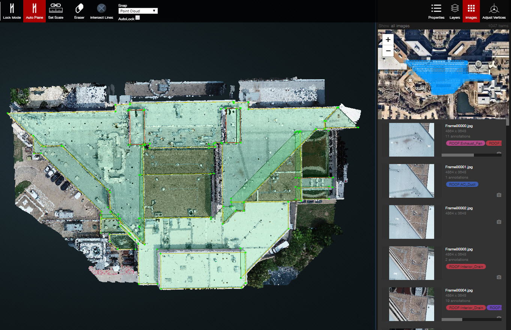

# Images

If you open the Images panel, you will see all of the 2D images \(including the Ortho image\) along with all of the camera locations. This is where we are going to do the 2D annotations and a more detailed training/workflow is coming too.

