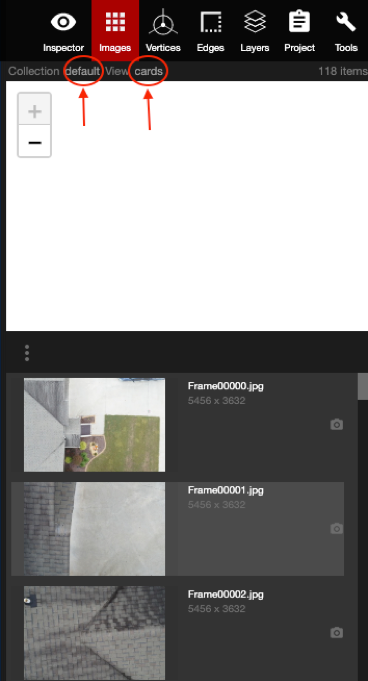

# Images

When the Images panel is opened, users will see all of the 2D images \(including the Ortho image\) along with all of the camera locations. This is where the 2D annotations will be completed. A more detailed training/workflow will be added soon.

#### Collection

#### Views

