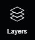

# Layers

The Layers panel includes all of the layers that are available within a project. Everything in the 3D window is on a layer, including the Point Cloud. Each layer can be turned on/off by clicking the little eye to the left of the layer's name. By default, every project starts with the Wireframe, Vertex, Edge, Plane, Widget, Region of Interest, and Point Cloud layers on.&#x20;

When working on a project, this panel allows users to quickly check the dimensions of the edges/planes, the Region of Interest (ROI), turn on/off the Point Cloud to check parts of the wireframe, and turn on/off the Cameras to help determine an inconclusive ROI.

.png>)

The following pages of the User Guide give examples of the main layers: [Wireframe](wireframe.md), [Bounding Boxes](bounding-boxes.md), [Vertex](vertices.md), [Edge](edges.md), [Plane](planes.md), [Widget](widget.md), [Region of Interest](region-of-interest.md), [Ortho Map](ortho-map.md), [Point Clouds](point-clouds.md), [Cameras](camera.md), and [Ortho Layer](ortho-layer.md).

