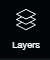
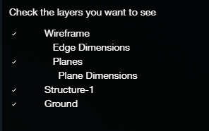

# Layers

Here are the articles in this section:


This page is under construction to get a better layout.


You can turn on and off the different layers.

Wireframe: The entire wireframe including all of the dimensions and planes. Edge Dimensions: The measurements of the edges. Planes: The green shade of the detected planes. Plane Dimensions: The SurfaceArea/Perimeter/Pitch of each plane. Camera: All of the cameras captured in the scene. Structure-1: The point cloud of the different structures. Ground: The point cloud of the ground.

