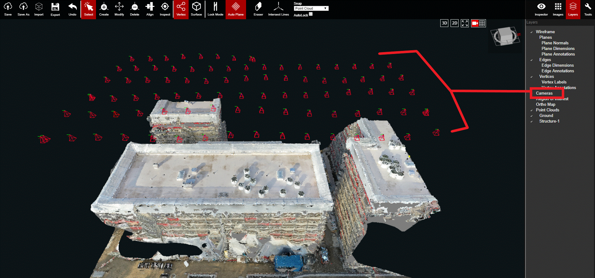
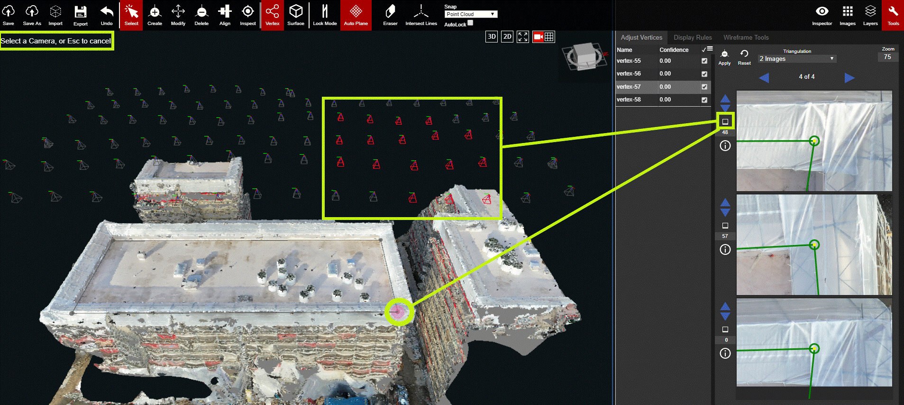

# Cameras

This layer controls the visibility of the cameras in relation to the point cloud.

All of the camera locations will be seen above the 3D point cloud when the Camera layer is on. If you select one of the red cameras, then the relative camera view will be updated in the 2D viewport.

You can also view all of the camera locations/views available for each vertex. Select a vertex, then click on the white square icon beside each 2D image in the Adjust Vertices panel.

In the image above, the vertex in the yellow circle is selected and the 2D images correspond to that vertex. After clicking on the white box on the left of the first 2D image, the Cameras layer automatically turns on. The red cameras will be the only cameras with images/frames of the selected vertex. All of the other cameras will be greyed-out. Selecting any of the red highlighted cameras will change the frame of the 2D image to match the selected camera.

