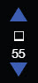
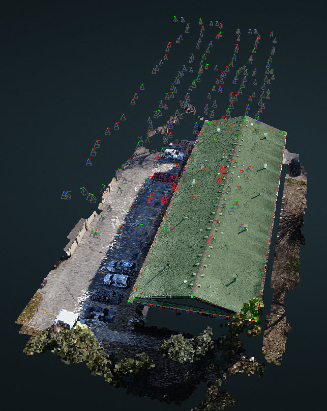

# Camera


🚧🚧 Under construction by Tianze 🚧🚧


You should be able to view all of the camera locations by clicking the camera icon beside each image.

All of the camera locations will be seen above the 3D model in the Camera layer. If you select one of the red cameras, then the relative camera view will be updated in the 2D viewport.

