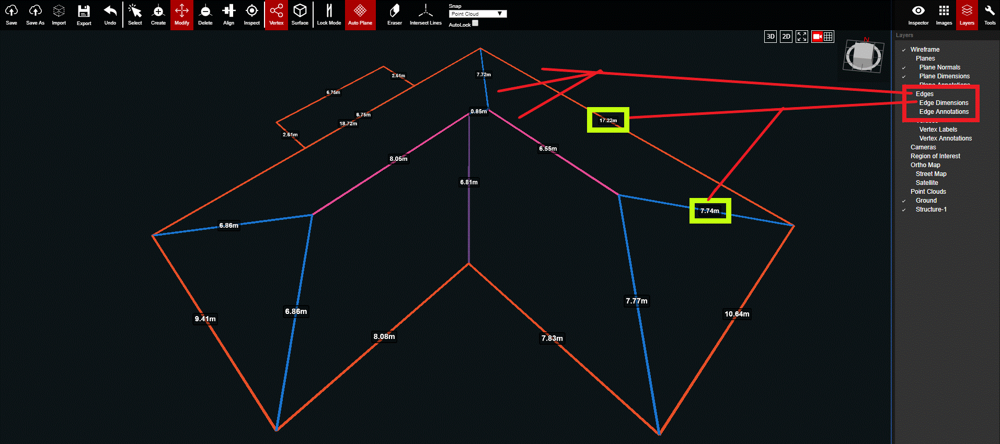

# Edges

This layer controls the visibility of the Edges, and also more detailed information such as Edge Dimensions and Edge Annotations.

  
In the image above, two of the Edge Dimensions are outlined in yellow and an Eave, Hip, and Ridge are pointed to in red.

