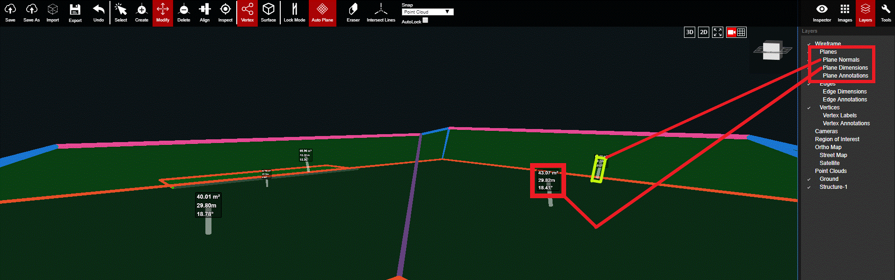

# Planes

This layer controls the overall visibility of the planes/surfaces and also more detailed information such as Normals, Dimensions, and annotations. The Planes layer does not include edges or vertices.

