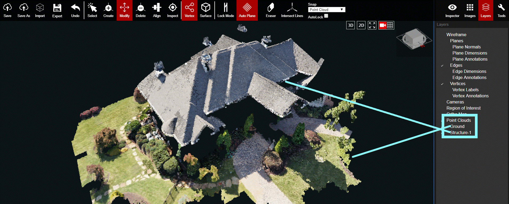

# Point Clouds

The Point Couds layer controls the visibility of the point cloud's Ground and Structure sub-layers.

In the example above, there are 2 sub-layer point clouds within the overall Point Clouds layer. The quantity of Point Cloud sub-layers will vary project to project.

