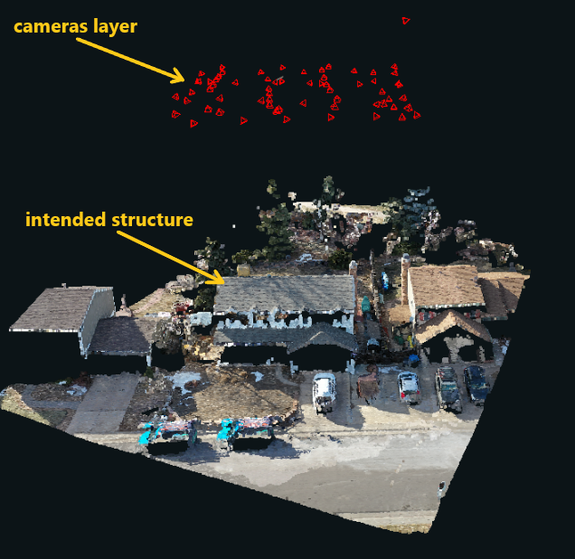

# Region of Interest

The Region of Interest \(ROI\) is an opaque, grey box outlining the structure that needs to be wireframed on the point cloud. When the point cloud contains multiple structures, users can look at the ROI to determine which structure is intended for processing. In the Layers panel, the ROI can be turned on/off by clicking the eyeball to the left of 'Region of Interest', or by using the hotkey: R

**For Kespry ROIs:** 

* The ROI might be offset and/or inaccurate. 
* Kespry's ROIs are used to design the flight pattern, and the point cloud is generated based on that. 
* Their customers do not get to see the point cloud while setting the ROI. 
* If the ROI isn't fully covering a structure, users should wireframe the structure that has the majority of the ROI around it.

**For DroneDeploy ROIs:** 

* The ROI is usually correct and precise. 
* DroneDeploy's customers get to draw their ROI directly on the structure's point cloud, making them very accurate. 


**There should only be one ROI with one structure inside for each project.** If there are multiple structures within one ROI, then the project should be put in\_support. If there are multiple ROIs in one project, with no duplicates for each additional ROI, then the project should be put in\_support. Refer to this link for rules about putting projects in\_support: [https://pointivo.atlassian.net/wiki/spaces/CO/pages/170229773/In+Support+Projects](https://pointivo.atlassian.net/wiki/spaces/CO/pages/170229773/In+Support+Projects)



DroneDeploy **Enterprise** projects will not have a ROI included


### How to deal with a missing/inconclusive ROI:

When the ROIs are offset, incorrect, or completely missing, the Cameras layer can be used to clarify the location that should be wireframed. Turn the Cameras layer on, in the Layers panel, and a pattern of red cameras will be floating above the intended structure on the point cloud \(image below\). 

\*\*If the Cameras layer does not clarify the ROI, then the customer will need to be contacted.

