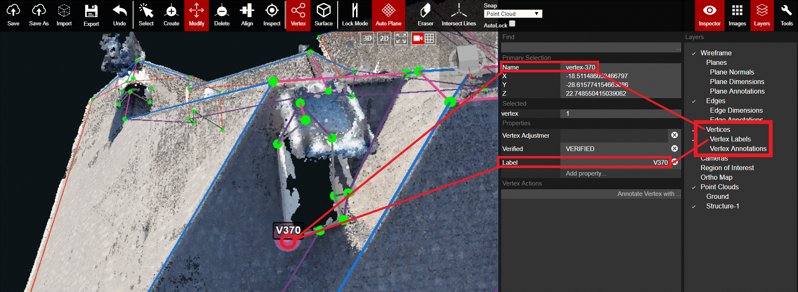

# Vertices

This layer controls the visibility of the properties and dimensions of each vertex. 

In the image above, the circled vertex has a default vertex Name of vertex 370. The default name and X, Y, Z dimensions show up for each selected vertex, but in the example above the user has also added a label to the vertex of "V370". Vertex Labels is a sub-layer of the Vertices layer, and it is useful to trigger it on/off when you are trying to find a specific vertex from quickly glancing at the overall wireframe.

