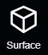
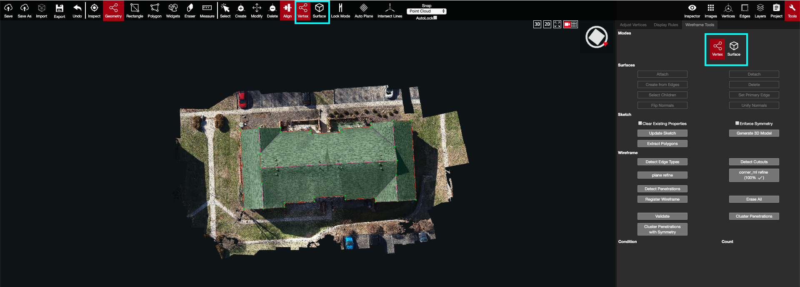

# Vertex and Surface Mode

There are 2 modes available in the 3D tool: Vertex and Surface -- edges are included in Vertex mode. These modes are important because they determine what a user is able to select, and manipulate, in the 3D tool. It is important to ensure you are in the correct mode when altering vertices, edges, and surfaces. Functions under Surface mode will not work on surfaces if the tool is in Vertex mode, and vice versa.

.png>)

Vertex Mode is the default mode in the 3D Tool. It is the only mode that the vertices and edges can be altered, created, or deleted in the 3D view. Planes/Surfaces can not be selected in this mode.

Surface mode is the only mode that the planes can be altered, created, or deleted in the 3D view. Vertices and Edges can not be selected in this mode.

