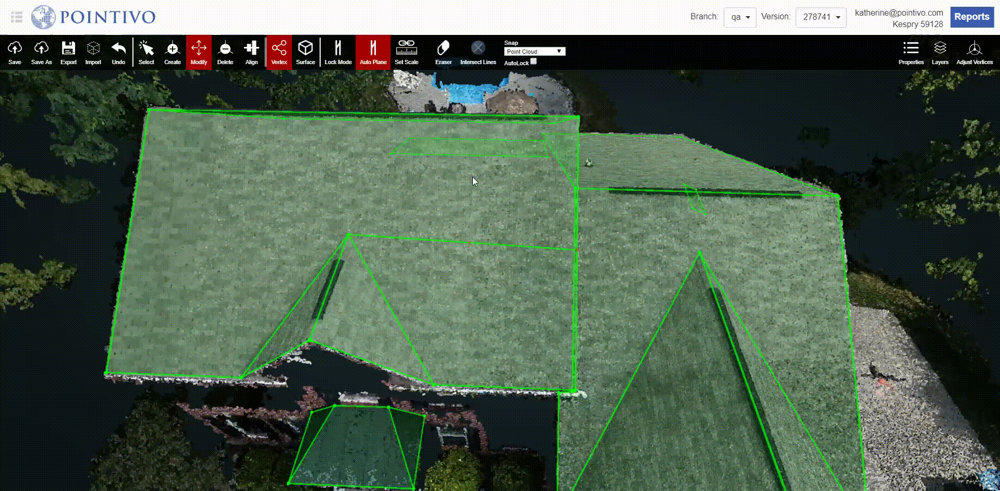
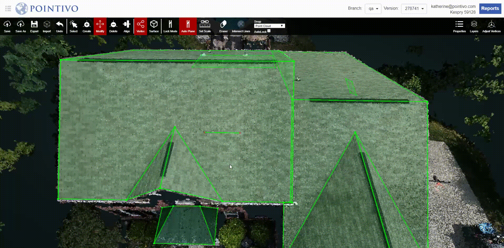

# Edge Mode

1. Under [Modify](../basic-function/#modify) and [Vertex Mode](./#vertex-mode), select a edge which you would like the vertices to fix in and press `Space` to lock it.
2. Under [Modify](../basic-function/#modify) and [Vertex Mode](./#vertex-mode), Hold and Drag the vertex on 3D view. 
3. When [Lock Mode](../advanced-function/#lock-mode) is off \(default\). The vertex can be only moved on the locked edge.
4. When [Lock Mode](../advanced-function/#lock-mode) is on. The vertex can be only moved on the parallel edge.

In the video above, Lock Mode is off \(default\) and one of the edges is locked. The selected vertex snaps to the locked edge when you modify it. The vertex can only move in the direction of the locked edge.

In this video, Lock Mode is on and one of the edges is locked. When you modify the vertex it moves in the parallel direction of the locked edge. You can put the vertex anywhere on the point cloud but once an edge is locked and Lock Mode is turned on, then the vertex will only move in the parallel direction of the locked edge.

