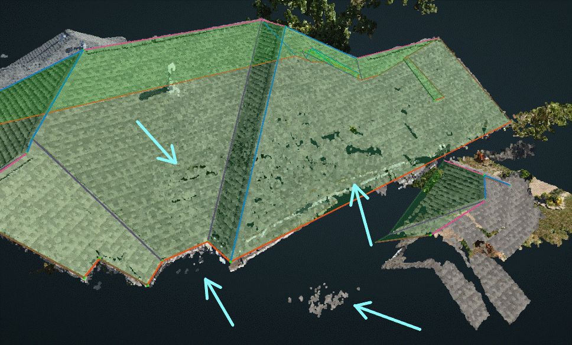
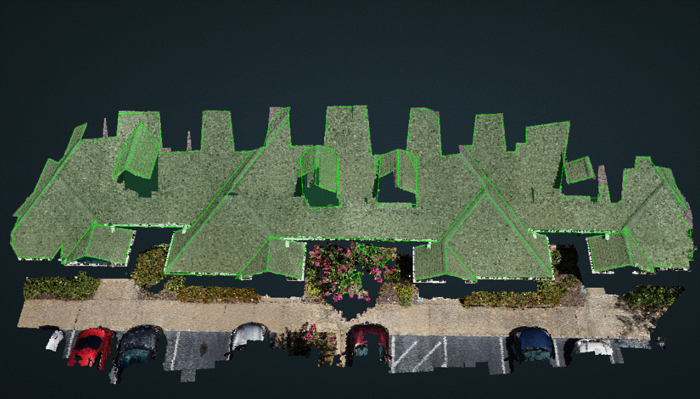
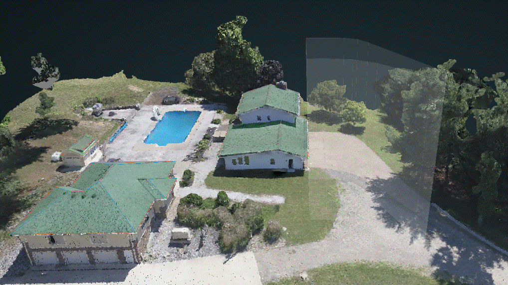
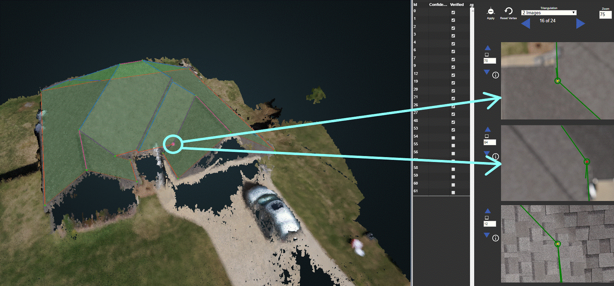
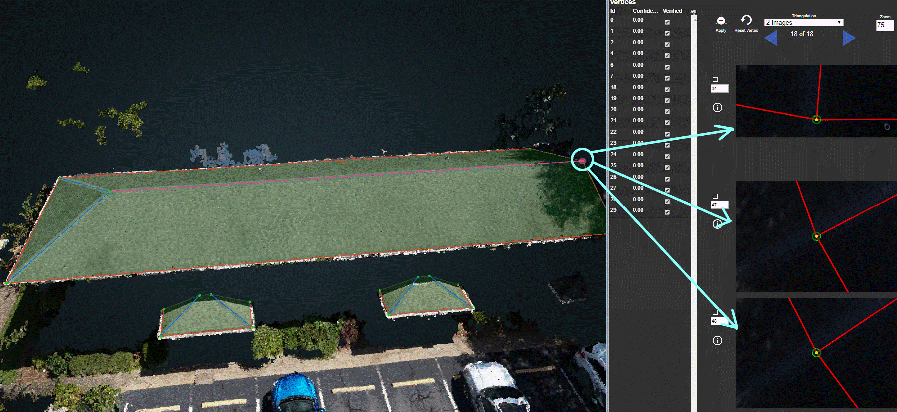
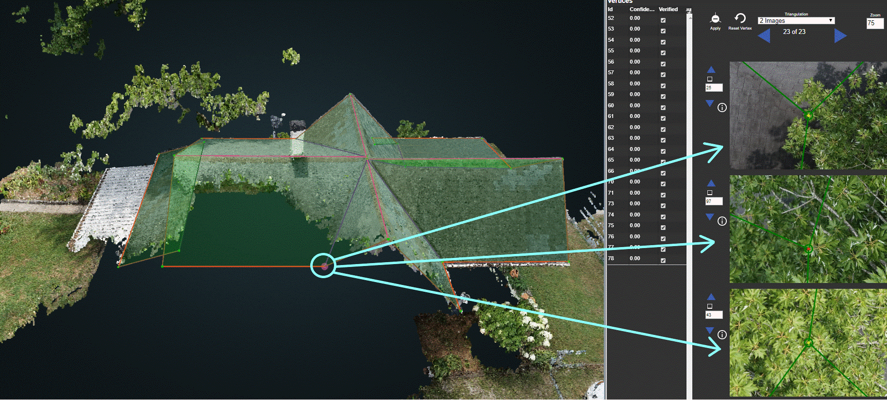
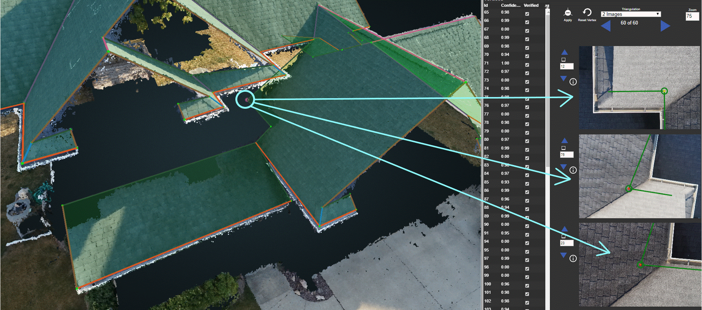
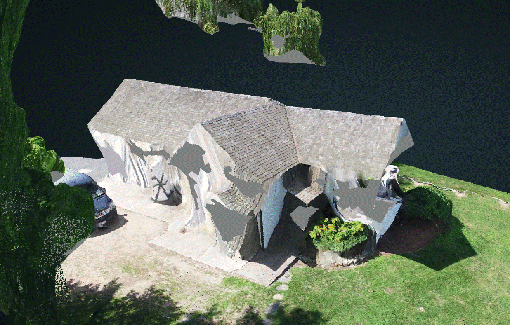

# Project Issues

The Project Issues section is used to record the issues/problems found within a project. It is important to verify a project's issues in order to determine the cause of any inaccuracies in a wireframe, such as inconsistent measurements or a long qa time. The available issues are listed below, along with a description and example image for each.

## Reprojection Error

Reprojection Error \(RPE\) occurs when there is an error in aligning cameras during the reconstruction process. This causes one or more of the 2D images to display an inaccurate location of a vertex.

## Noisy Point Cloud

A Noisy Point Cloud occurs when the point cloud of the structures are not well defined. The edges/corners of the structures are may be unclear too. Noise also make the point cloud look like it's rough or jagged. Some noisy sections are pointed out in the image below.

## Broken Point Cloud

A Broken Point Cloud is typically caused by occlusion, like tree coverage or a lack of enough image overlap. The structure may still be correct, but missing portions of it.

Refer to the [How to Deal with a Broken Point Cloud](../special-cases/how-to-deal-with-a-broken-point-cloud.md) section for instructions on dealing with severely broken point clouds like the example below.

## Wrong Region of Interest

The Wrong Region of Interest \(ROI\) issue occurs when the ROI is specified but the structure is unclear, incomplete, or the ROI is in the wrong location altogether like the image below.

## Blurry Frames

Blurry Frames is when one or more of the 2D images have blurriness and are unclear.

## Image Illumination

Image Illumination means that one or more of the 2D images were over or underexposed, making it more difficult to accurately verify the location of a vertex. This is typically due to shadows, glare, or a very bright/dark time of the day during drone capture.

## Partial Occlusion

Partial Occlusion is the result of part of the structure being occluded/covered on the point cloud and in the 2D images. This causes the structure, and resulting vertices, to be estimated and inaccurate. Occlusion is usually the result of trees or overhangs.

## Indeterminate Region of Interest

An Indeterminate ROI means that the ROI is unclear. This can be the result of the ROI not being specified, no structure in the ROI at all, or more than one significant structure \(outside of the customer's request\) is being included in the ROI.

## Unsupported Geometry

Unsupported Geometry means that part of the structure cannot be represented, often because of a conical or curved structure.

## Low Point Cloud Density

Low Point Cloud Density is when the density of the point cloud is below the recommended levels \(2,500 points per square meter\)

## Defective Reconstruction

Defective Reconstruction means that the project was unable to be processed because of partial, or completely wrong, image alignment. It causes the point cloud to no longer be geometrically sound.

## Large Structure Sample Distance

Large Structure Sample Distance \(SSD\) occurs when the camera is too far from the structure or has low resolution. This results in 2D images that display the structure from a much farther distance than usual, and will become blurry as they are zoomed in on. The accuracy of the wireframe will not meet expectations.

## Smoothed Point Cloud

A Smoothed Point Cloud is often the result of meshing, and will cause the surfaces to be blended and the point cloud to have edges that are not crisp.

## Project Type Mismatch


This issue only occurs in DroneDeploy projects!


When the structure in a project does not match the structure listed in the project's _**Description**_, please mark this project issue. 

Example image below: On the intranet, a project's description says DD\_Residential, but when the project is opened it's actually a Commercial structure. That is a project type mismatch.


Projects with the Project Type Mismatch issue will need to be put in\_support, and posted on the in\_support\_projects channel on Slack. Refer to this link, and follow the instructions, for putting a project in support:

[https://pointivo.atlassian.net/wiki/spaces/CO/pages/170229773/In+Support+Projects](https://pointivo.atlassian.net/wiki/spaces/CO/pages/170229773/In+Support+Projects)




