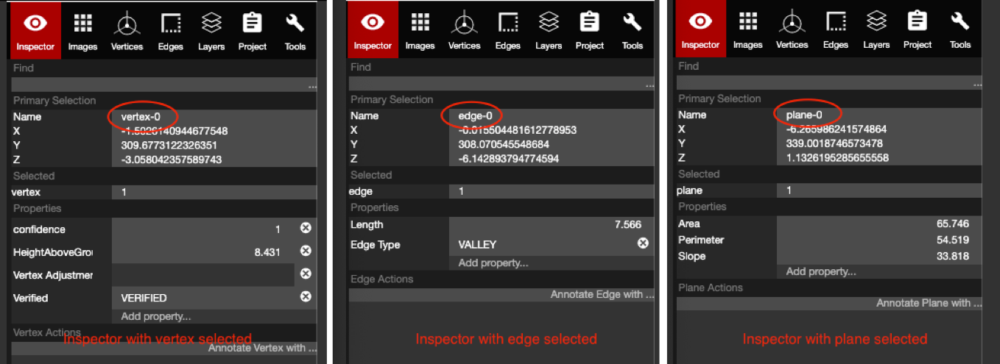
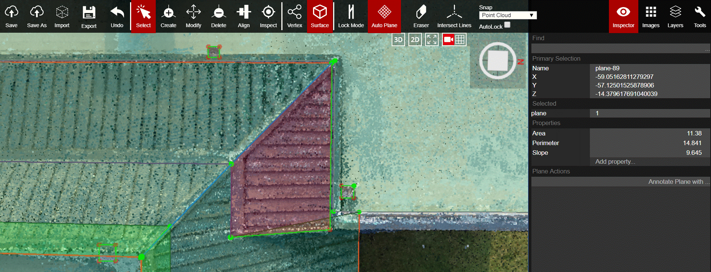

# Inspector

The Inspector panel is used to show the properties of any vertex, edge, or plane in a wireframe. When an issue arises in a project, the Inspector can be used to identify which piece of geometry has the problem and the user will be able to report the exact location of the issue. The Inspector panel can also be used to search for a specific vertex, edge, or plane.

### Sections of the Inspector Panel

* **Find:** This is the search bar for the Inspector panel. All vertices, edges, and planes are listed in the dropdown of this search bar. Users can also type in the name of the vertex, edge, or plane and select it from the list. Once selected, the tool will reorient the 3D window to focus on that specific piece of geometry.
* **Primary Selection:** This section shows the Name and X, Y, Z coordinates of a selected vertex, edge, or plane.
* **Selected:** Shows what type of geometry is selected \(vertex, edge, plane\), and how many of that object type. If 3 vertices are selected at once, then the Selected bar would read:    vertex     3
  * This is not the name of the specific vertex, edge, plane -- the only place the actual names of each vertex, edge, plane shows up is in the Primary Selection section next to Name.
*  **Properties:** Lists all of the properties for a given selected piece of geometry. If a piece of geometry needed to have a label, i.e. a gutter edge or a penetration, then the Properties section is where a label can be added. The default properties for Vertex, Edge, and Plane are listed below:
  * For a Vertex: Confidence number, Height Above Ground, Vertex Adjustment, and Verified
  * For an Edge: Length, and Edge Type -- edge types can be changed here as well as the [Edges](edges.md) panel
  * For a Plane: Area, Perimeter, and Slope
  * Other Properties available to add: Edge Type, Verified, Exclusion, Elevation, Confidence, Label, Layer, Height Above Ground Plane, Polygon Shape, Custom Integer, Custom Double, Custom Text
* **Actions: \***This section is mainly ignored for now\*. Annotations can be added here in a broad sense. There are no tools to draw the annotations, but they can be added into the Inspector list for each Edge and/or Plane. It will not show any annotations on the images or point cloud.

