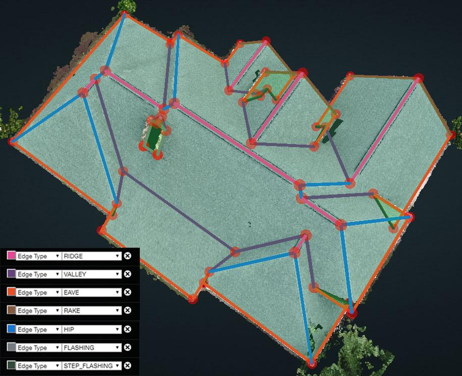

# Edge Types

**Common Edge Types**

|  | Number of Planes | Angle | Parallel to Ground |
| :--- | :--- | :--- | :--- |
| Eave | 1 |  | √ |
| Rake | 1 |  | × |
| Hip | 2 | "Λ" | × |
| Valley | 2 | "V" | × |
| Ridge | 2 |  | √ |
| Flashing | Only around the chimney |  |  |
| Step Flashing | Must be against a wall |  |  |
| Parapet | Only on flat roofs that are surrounded by, and enclosed in, a wall/ledge |  |  |

**Edge Type Example - QA Project: 6573**

