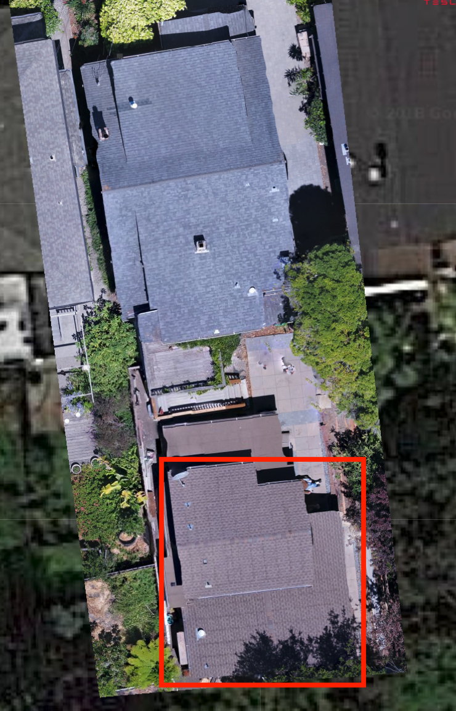
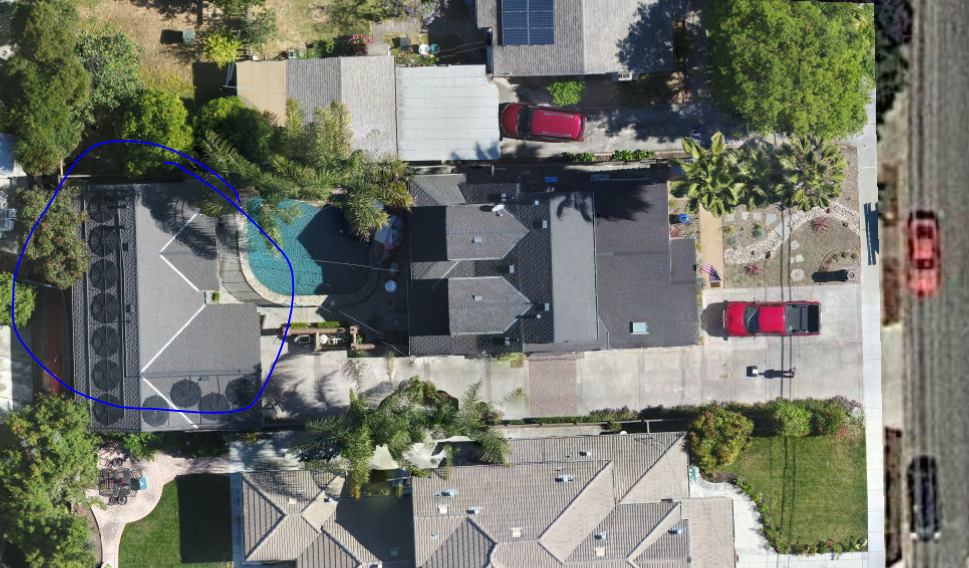

# Missing Secondary Structure

`From DroneDeploy    
For our jobs can you guys please do all structures on the property. Looking back, they seem to want all additional buildings that are modeled like the carport.`


Do NOT miss the secondary structure in projects, unless a DroneDeploy ROI specifically excludes it. 

Kespry ROIs are not as reliable, so assume they want the secondary structure. The following are some examples, in which we have missed the minor structure/garage in the past


The following images are some examples that show the secondary structures we have missed in previous projects. All of these projects were returned by the customer because of the missed structures.

