# Project Issues

## Reprojection Error

A Reprojection Error \(RPE\) occurs when there is an error in aligning cameras during the reconstruction process, thereby causing one or more of the 2D images to display an inaccurate location of a vertex.

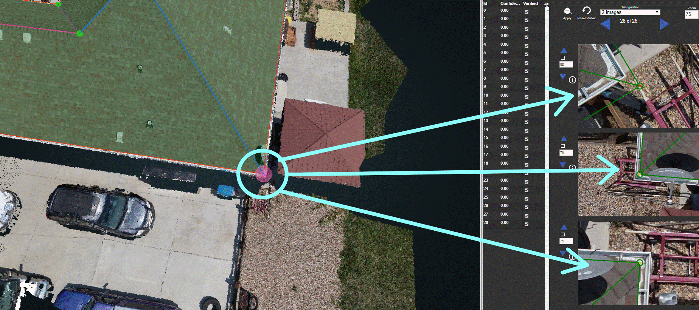

## Noisy Point Cloud

A Noisy Point Cloud occurs when the point cloud structures are not crisp, and the edges/corners of the structures are unclear.

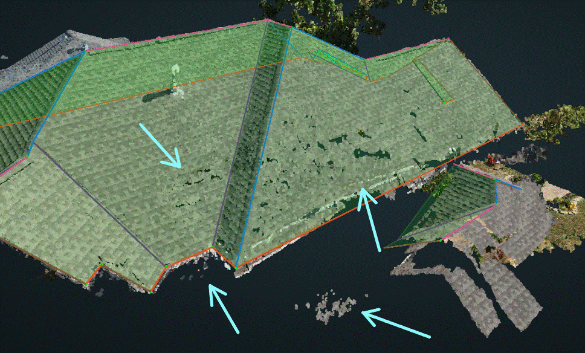

## Broken Point Cloud

A Broken Point Cloud is typically caused by occlusion, like tree coverage or a lack of enough image overlap. The structure may still be correct, but missing portions of it.

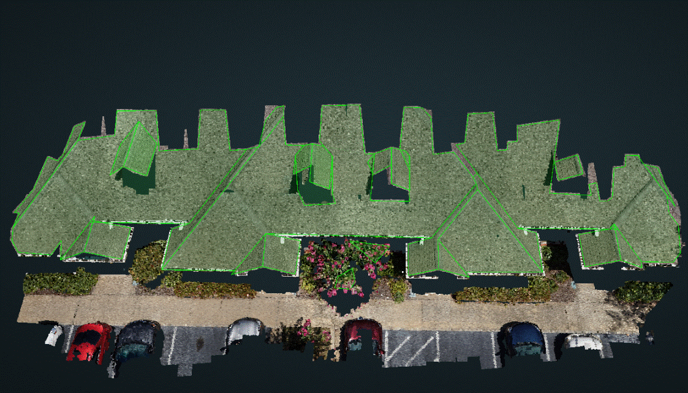

## Wrong Region of Interest

The Wrong Region of Interest \(ROI\) issue occurs when the ROI is specified but the structure is unclear, incomplete, or the ROI is in the wrong location altogether.

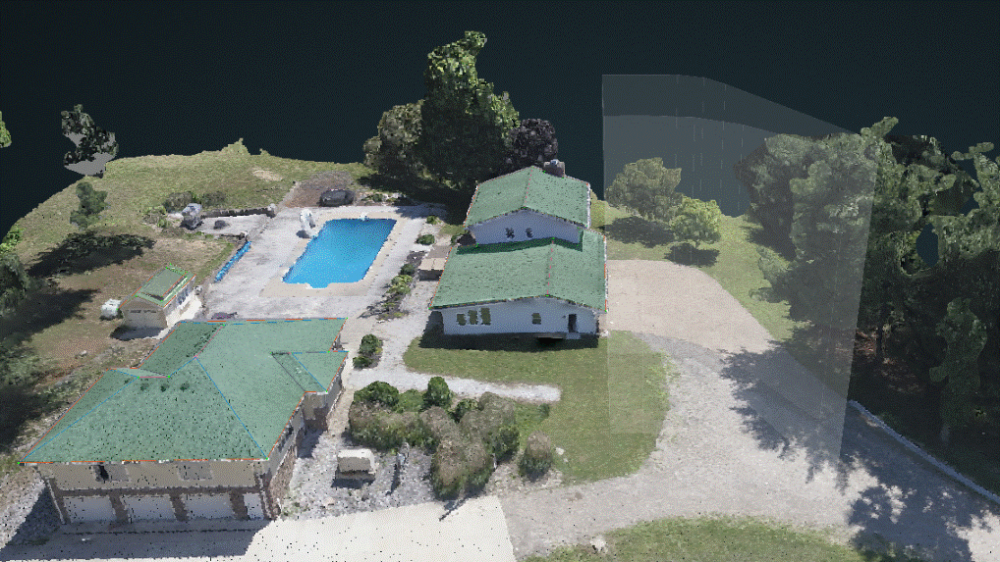

## Blurry Frames

Blurry Frames is when one or more of the 2D images have blurriness and are unclear.

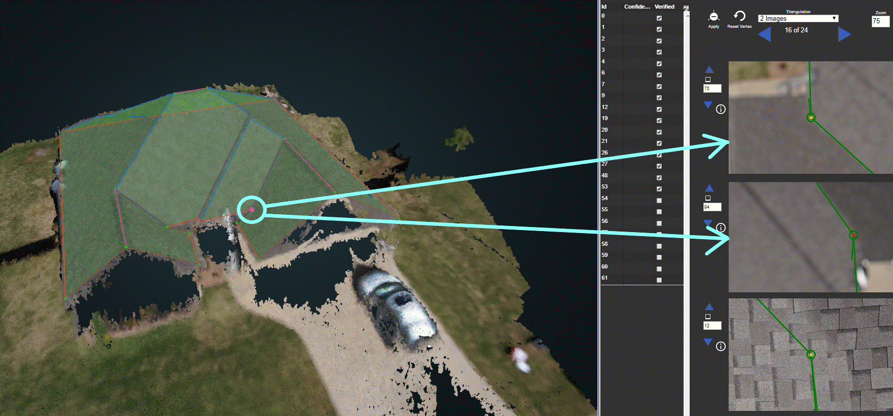

## Image Illumination

Image Illumination means that one or more of the 2D images were over or underexposed, making it more difficult to accurately verify the location of a vertex. This is typically due to shadows, glare, or a very bright/dark time of the day during drone capture.

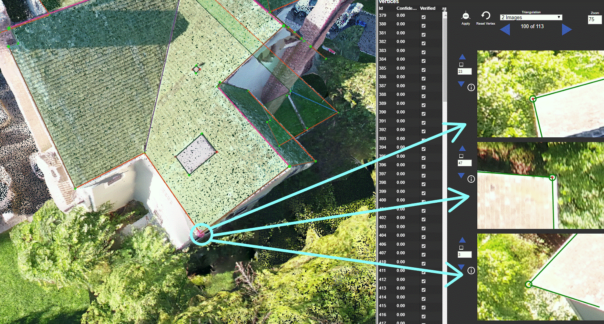

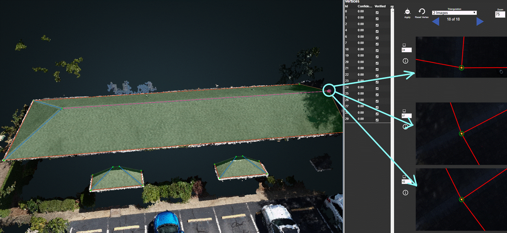

## Partial Occlusion

Partial Occlusion is the result of part of the structure being occluded/covered on the point cloud and in the 2D images. This causes the structure, and resulting vertices, to be estimated and inaccurate. Occlusion is usually the result of trees or overhangs.

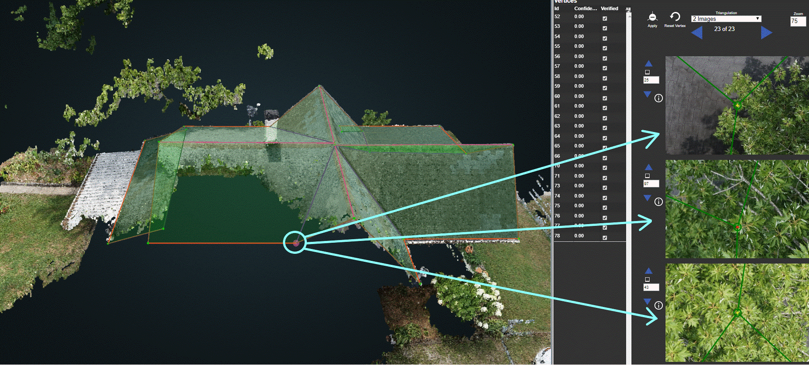

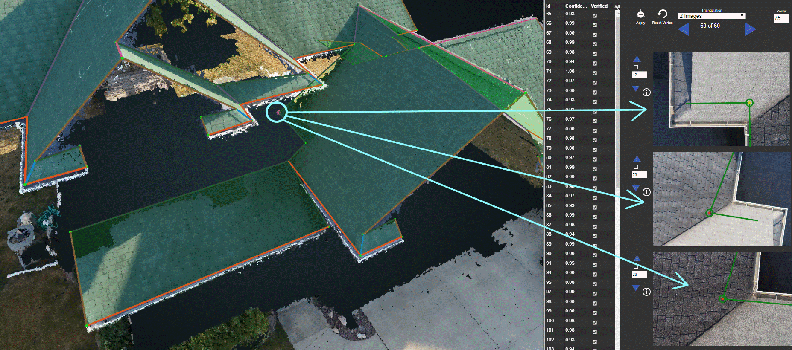

## Indeterminate Region of Interest

An Indeterminate ROI means that the ROI is unclear. This can be the result of the ROI not being specified, no structure in the ROI at all, or more than one significant structure \(outside of the customer's request\) is being included in the ROI.

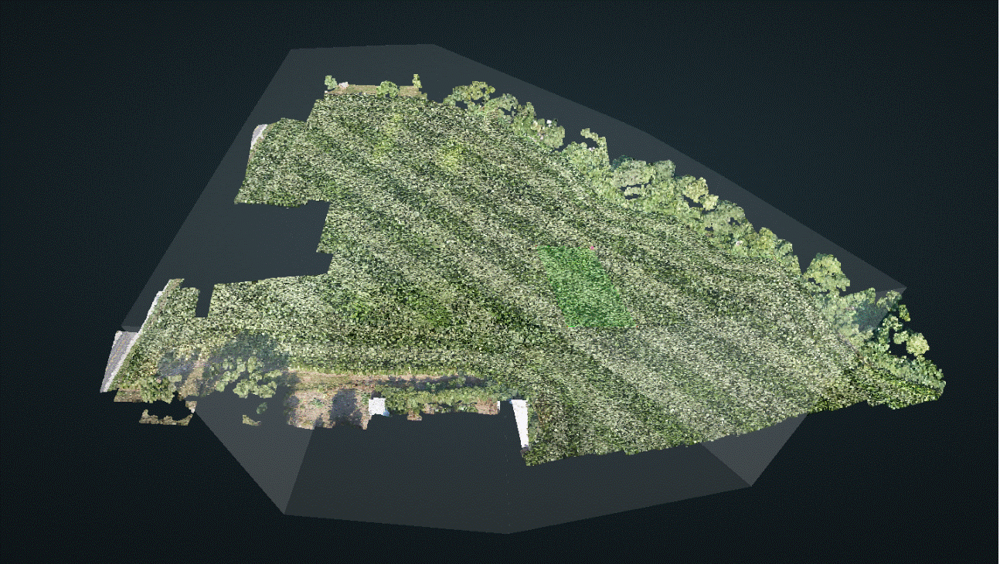

## Unsupported Geometry

Unsupported Geometry means that part of the structure cannot be represented, often because of a conical or curved structure.

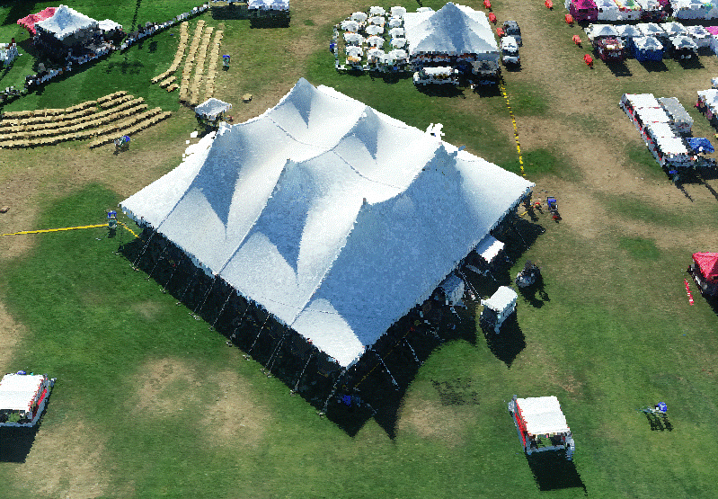

## Low Point Cloud Density

Low Point Cloud Density is when the density of the point cloud is below the recommended levels \(2,500 points per square meter\)

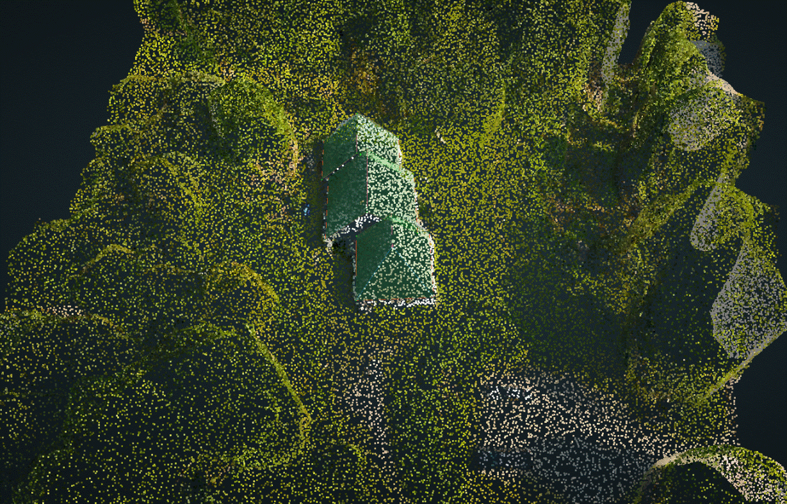

## Defective Reconstruction

Defective Reconstruction means that the project was unable to be processed because of partial, or completely wrong, image alignment. It causes the point cloud to no longer be geometrically sound.

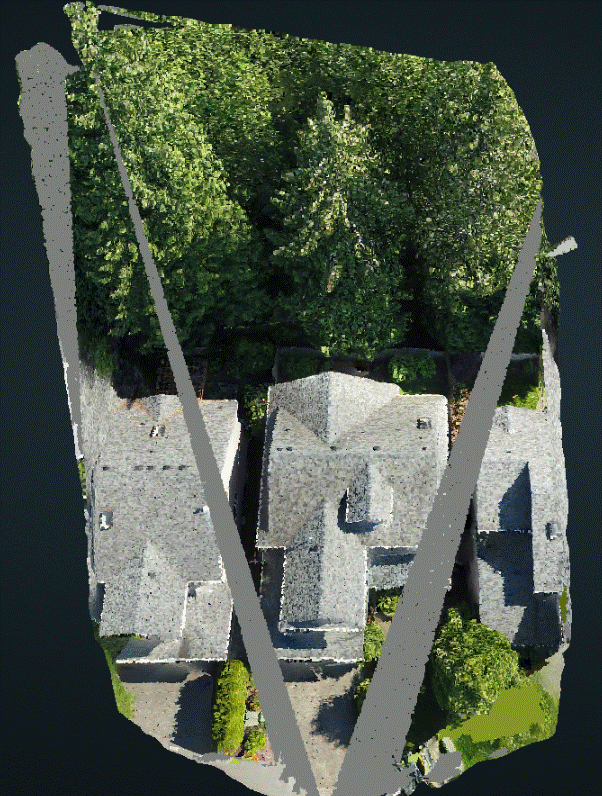

## Large Structure Sample Distance

Large Structure Sample Distance \(SSD\) occurs when the camera is too far from the structure or has low resolution. This results in the pixel size on the structure being large, and/or the 2D images loading from a far distance and becoming blurred when zooming in on them. The accuracy of the wireframe will not meet expectations.

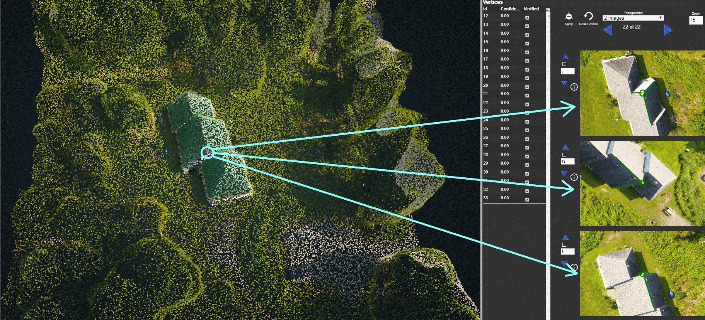

## Smoothed Point Cloud

A Smoothed Point Cloud is often the result of meshing, and will cause the surfaces to be blended and the point cloud to have edges that are not crisp.

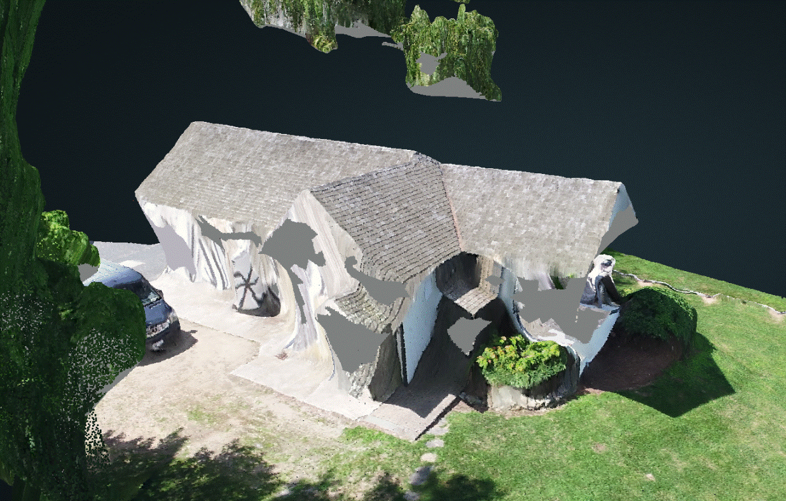

## Project Type Mismatch

This Project Issue is only for Standard DroneDeploy project.

When the actual project structure type does not match the input structure type, please mark this project issue and at the same time, change the structure type to what it should be.

For example, we receive a huge Commercial building but it was detected as SingleFamily. Please check this project issue and change the structure type to Commercial.

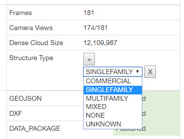

Refer to Structure Types page to understand the definition of different structure types.



