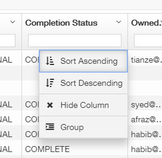

# Project Priority and Intranet Sorting Tips


Please refer to this link for Customer Operations Priorities overall: [https://pointivo.atlassian.net/wiki/spaces/CO/pages/119177217/Customer+Operations+Priorities](https://pointivo.atlassian.net/wiki/spaces/CO/pages/119177217/Customer+Operations+Priorities)


**Project Priority:** Old projects have a higher priority than new projects. Past Due \(red\) projects have higher priority over the Warning \(yellow\) or Ready/In\_QA \(green\) projects.

Based on this, when you get online and check the project queue, please make sure you pick the oldest Past Due project first. As you know, it is easy to Search or Sort the projects via the Intranet view, but you can also Group the projects in order to see the projects with different status more clearly.

You can Group the projects by any of the columns but grouping by the Completion Status column, and sorting the Started column in Ascending order is going to help you the most. 

Then you will see each project by different Completion Status. When one of the Completion Statuses is opened, the projects will be sorted by oldest Started date/time. Generally, the past\_due projects take priority.

If you want to go back to the default view, just Ungroup the column.

## 

