# Review Pipeline

**Each reviewer, please follow the list in order during reviewing the projects.**

1 - Missing/Extra Structure, especially for the overhang

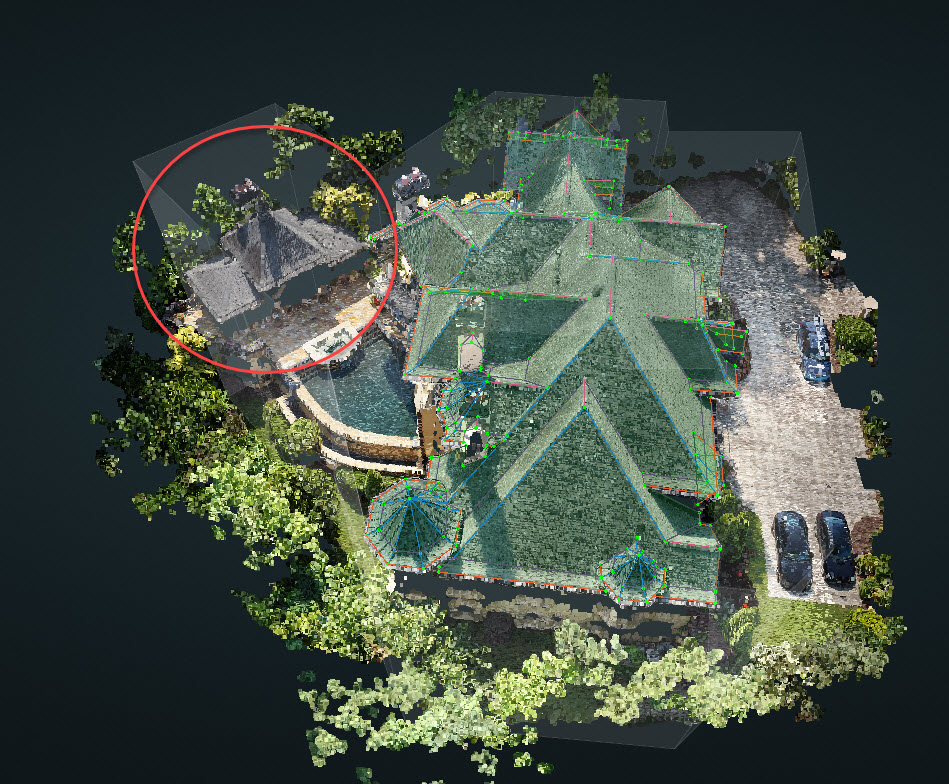

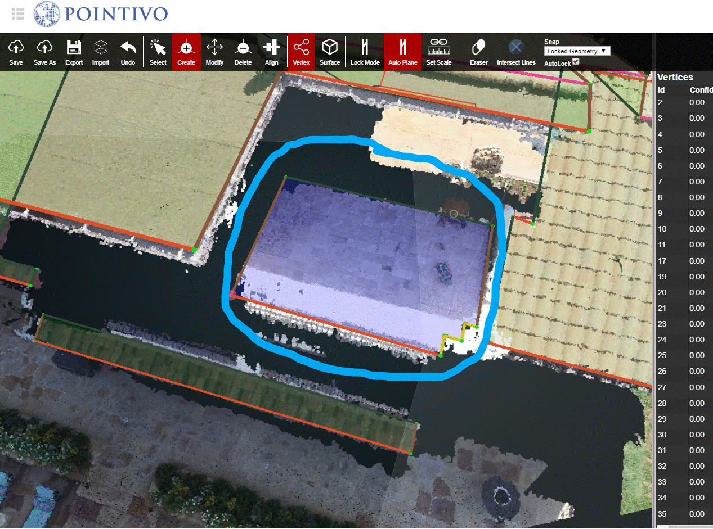

2 - Wireframe Structure

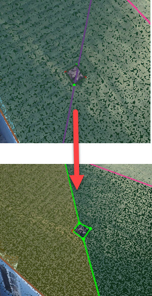

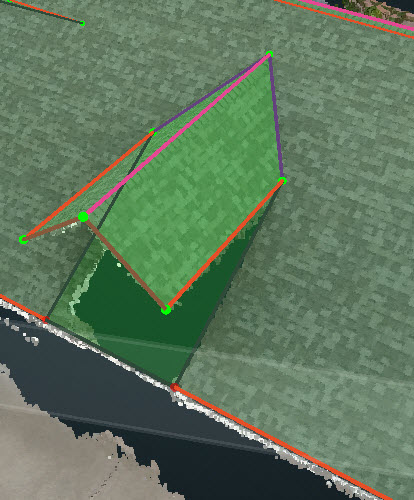

3 - Symmetry

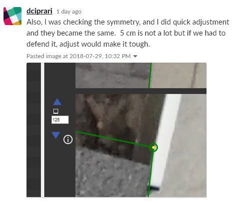

4 - Vertex locations

5 - Edge Types

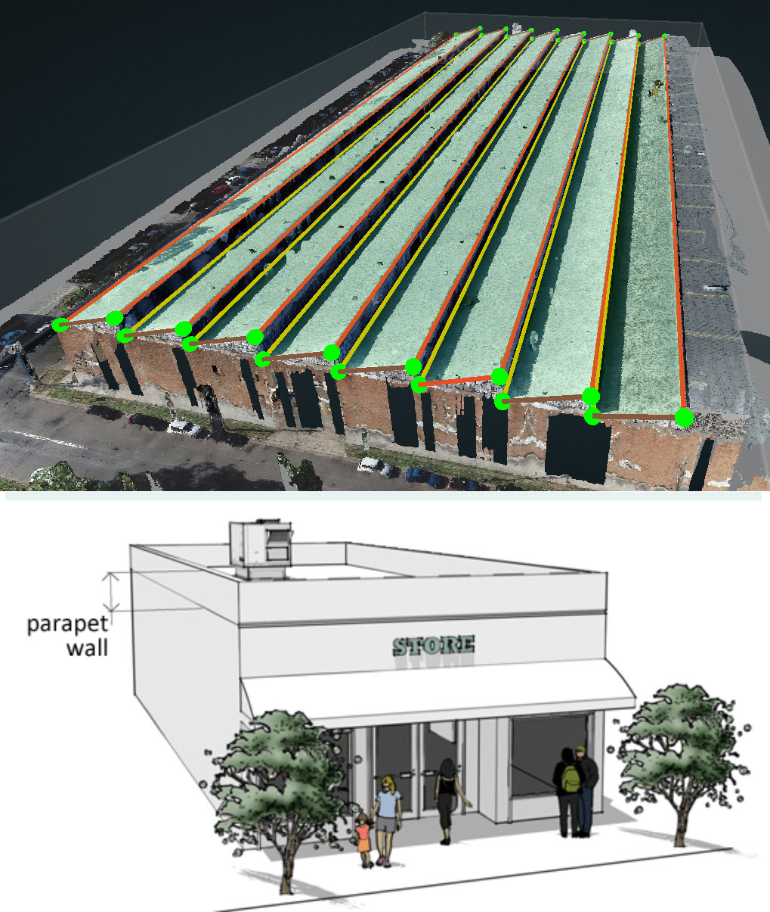

6 - Missing/Extra Penetrations

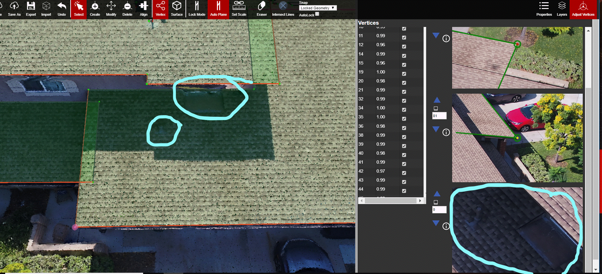

7 - Penetration Size

8 - DataPackage/GeoJSON

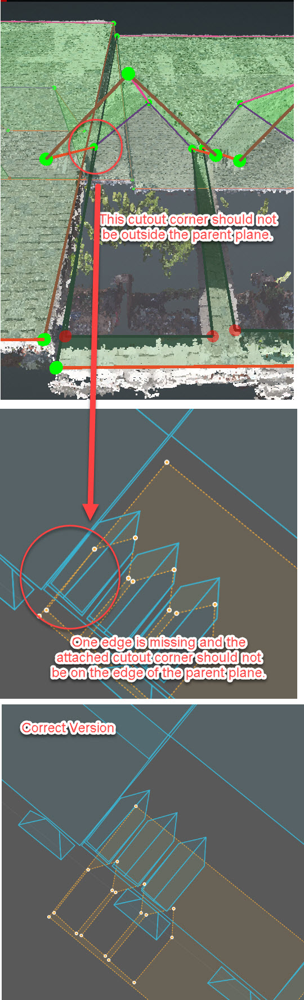

9 - Published Resources

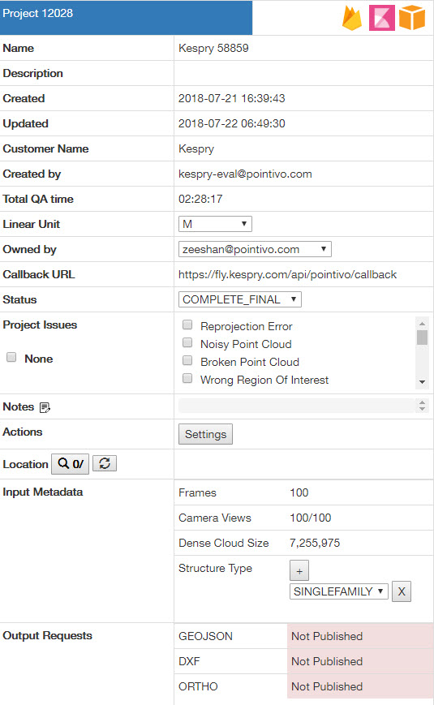

10 - Structure Type

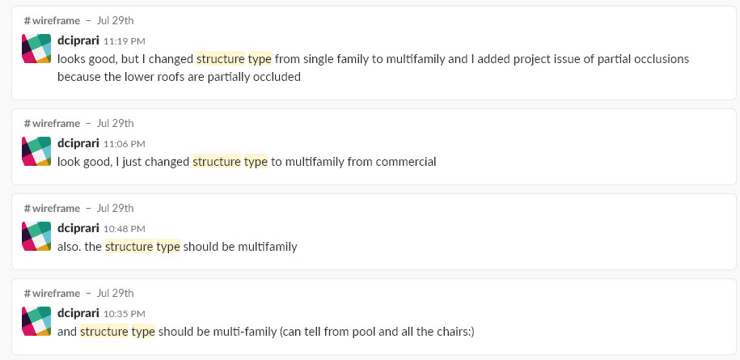

11 - Project Issues

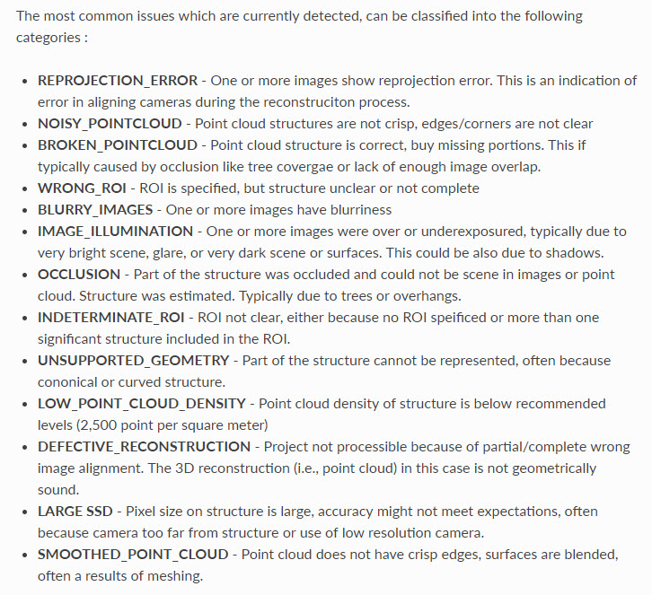

