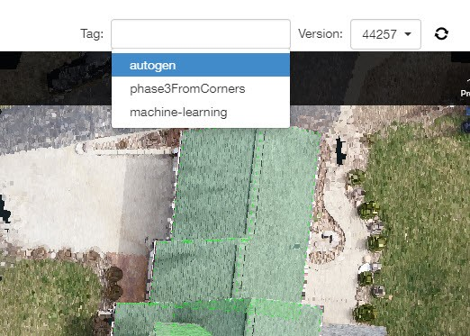
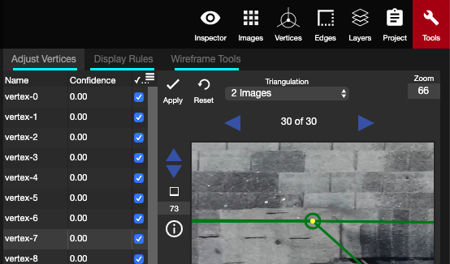
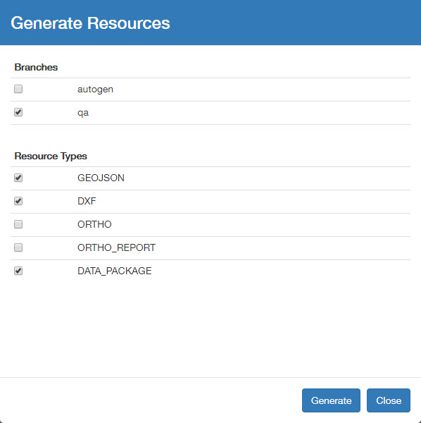
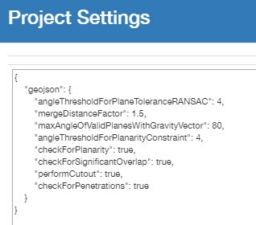
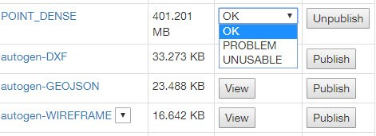
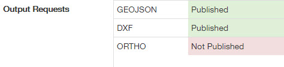

# Steps to QA a project

🚧🚧 Under construction by Tianze 🚧🚧

## Steps to QA a Project

1. Pick up the project from intranet, click View to open the 3DTool. Click the dropdown menu of Tag to make sure there is not any QA branch.

   

2. Save a new QA branch and tell everyone on Slack you are going to pick this project, in case of any duplicate work.
3. Check all the Autogen versions and find out the best one. [Delete](../tools/#delete) the redundant vertices and [Eraser](../advanced-function/#eraser) the missing vertices to draw the rough wireframe. Remember to draw all the [Penetration](../special-cases/#penetration) if it is a DroneDeploy project.
4. [Adjust Vertices](../advanced-function/#adjust-vertices) to finish the Ground Truth wireframe.
5. Open the Tools panel and click [Detect Edge Types](../tools/#detect-edge-types) to detect all the edge types.

   

6. Manually check all the edge types one by one and refer to [Edge Types and Example](https://github.com/tianzem/Gitbook/tree/2e9200fdef84ea3c8c4472af1a82e8fe48c2d6f7/edge-types-and-example.md) to correct the wrong edge type.
7. [Save As](../basic-function/#save-as) the project and Mark As Done.
8. Go back to Intranet and click Generate to have the different outputs.

   

   Branches: Select the branch you would like to generate the output. Typically, it should be qa. Resource Types: `GEOJSON: The main output file which needs to be checked on Mapbox.` `DXF: DXF file.` `ORTHO: Ortho image with the wireframe.` `ORTHO_REPORT:` `DATA_PACKAGE: All the output data including the pictures and JSON file.`

9. Click the View button besides qa-GEOJSON, then open the Mapbox Studio to check the wireframe layout
10. When there are missing edges/unusual edges/redundant areas etc, go back to 3DTool to check the relevant vertices. Make sure the vertices should be on a plane are in a plane and there are not any missing edges. [Save](../basic-function/#save) the Project, Generate the GEOJSON and check the Mapbox Studio again.
11. If the issue is not fixed, then check Kibana logs to see the possible causes. Click Settings to change the parameter threshold in Project Settings.

    

    **Plane:** "checkForPlanarity": false, `When it is set to True, it is going to use the angle threshold to constrain the planarity.` "angleThresholdForPlanarityConstraint": 4, `Intro` "maxAngleOfValidPlanesWithGravityVector": 80, `When the angle between the plane and the gravity vector is more than this number, this plane will not be detected.`

    "checkForSignificantOverlap": true, `When there are two planes overlapping with each other significantly, one of the plane will be deleted in GeoJson.`

    **Cutout:** "performCutout": true, `To detect cutout or not` "angleThresholdForCutoutDetection": 2, `Only when the angle (the distance between the cutout and the lower roof) is bigger than this number, the cutout will be detected.`

    **Penetration:** "checkForPenetrations": false, `To detect penetrations or not`

    **Step Flashing:** "polygonExpansionFactorForStepFlashings": 1.05, `Intro`

    **Chimney:** "minInnerChimneyPerimeterThreshold": 2, `Intro` "maxInnerChimneyPerimeterThreshold": 6, `Intro` "minOuterChimneyLengthThreshold": 0.5, `Intro` "maxOuterChimneyLengthThreshold": 2 `Intro`

12. If the point cloud is broken, mark the POINT\_DENSE as PROBLEM, if the point cloud is too bad to draw the wireframe, mark the POINT\_DENSE as UNUSABLE.

    

13. For Kespry projects, Publish the DXF and the GEOJSON. For DroneDeploy projects, Publish the DXF, the GEOJSON and the DataPackage. For PrecisionHawk projects, Publish the DXF, the GEOJSON and the DataPackage.

    

14. After click Publish, mark the final project as COMPLETE\_FINAL.

