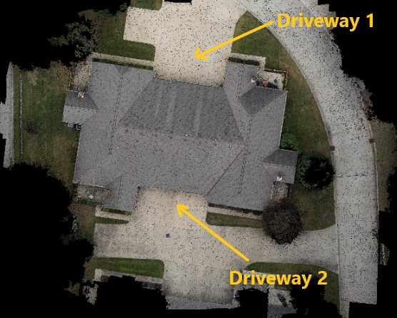
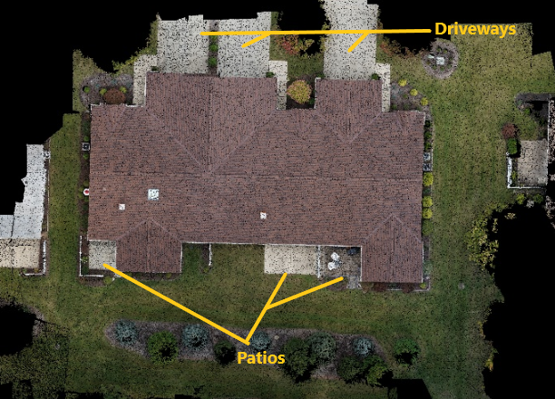
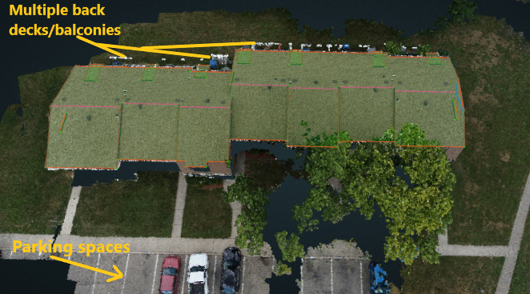
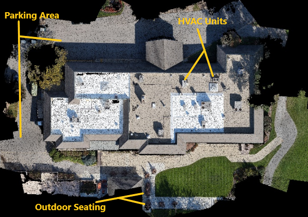
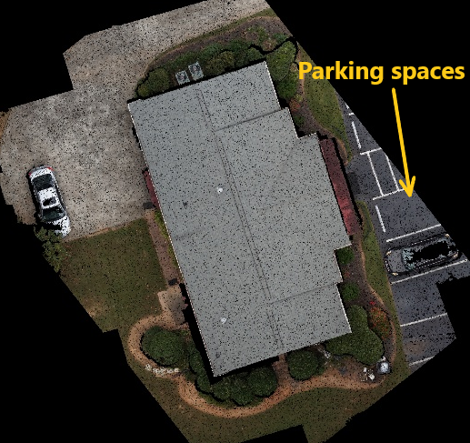
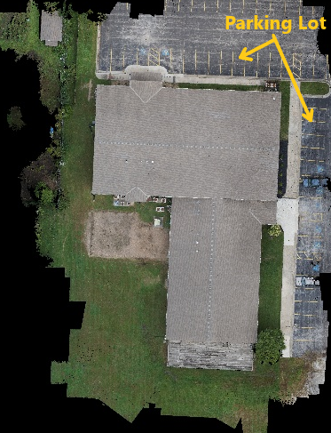

# Structure Types

If you are unsure what type of structure is shown on the cloud, then use Google Maps to look up the address. You will be able to see if the structure is part of a neighborhood or if it's surrounded by a parking lot/spaces. A lot of times commercial structures will already be labeled on the map. 

## SINGLEFAMILY

A single structure that houses 1 family. These structures can be small or large \(mansions\), and may have a detached garage or pool house nearby. A good sign for Singlefamily is that they generally only have one driveway. Sometimes they will have a fence around the backyard, or be separated by a privacy fence from the surrounding structures.

## MULTIFAMILY

Any structure that houses more than 1 family. This can be anything from a condominium, or duplex, to a large apartment complex. Look for shared parking areas, multiple balconies/patios, more than 1 backyard. Condos and townhouses will look smaller \(like a singlefamily\), but they will have more than one driveway.

## MIXED

Any combination of SINGLEFAMILY, MULTIFAMILY, or COMMERCIAL structures.

## COMMERCIAL

Factories, churches/cathedrals, hotels, warehouses, restaurants, malls, offices, schools, neighborhood clubhouses, covered parking structures. Look for structures surrounded by a parking lot or with marked parking spaces. Sometimes smaller commercial structures, such as a neighborhood clubhouse, will have seating surrounding it \(picnic tables, several chairs surrounding a pool, etc.\). A lot of large commercial structures will have HVAC units on the roof.

## UNKNOWN

Sheds, barns, outdoor areas. Look for metal roofs, slate roofs, terracotta roofs, etc.

## NONE

No structure in the scene or within the Region of Interest.

