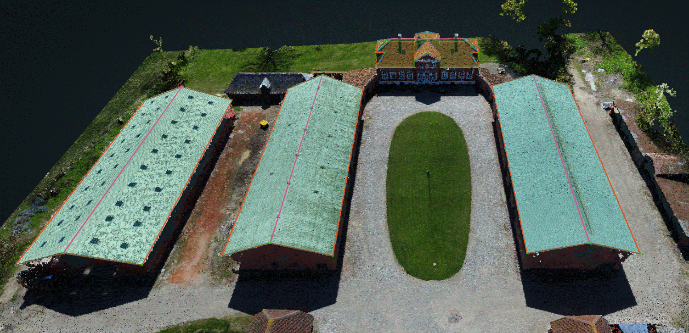
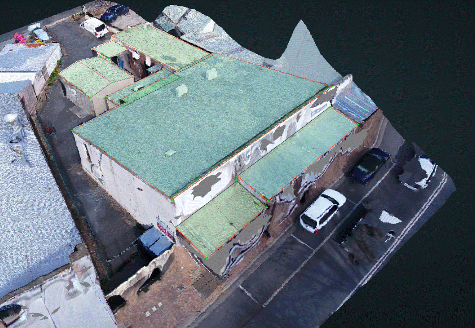

# Structure Types

## SINGLEFAMILY

Any single building or small group of buildings which houses about 1 family. Quite often 2-3 family homes will fall into this category as well.

## MULTIFAMILY

Any larger building which houses numerous families. This can be anything from a condo to a large apartment complex. Look for shared parking areas.

## MIXED

Any combination of SINGLEFAMILY, MULTIFAMILY, or COMMERCIAL structures.

## COMMERCIAL

Factories, warehouses, stores, malls, offices, schools. Look for buildings with AC units on the roof.

## UNKNOWN

Sheds, barns, outdoor areas. Look for metal roofs, slate roofs, terracotta roofs, etc.

## NONE

No structure in the scene or within the Region of Interest.

