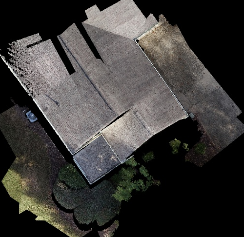
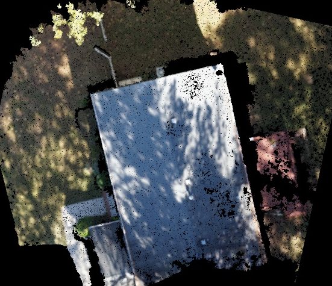
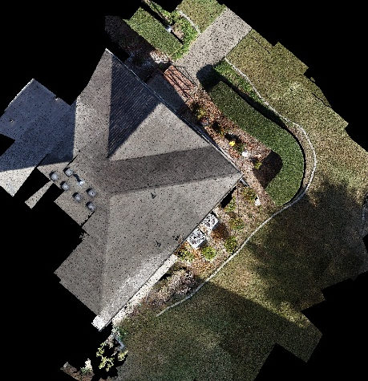
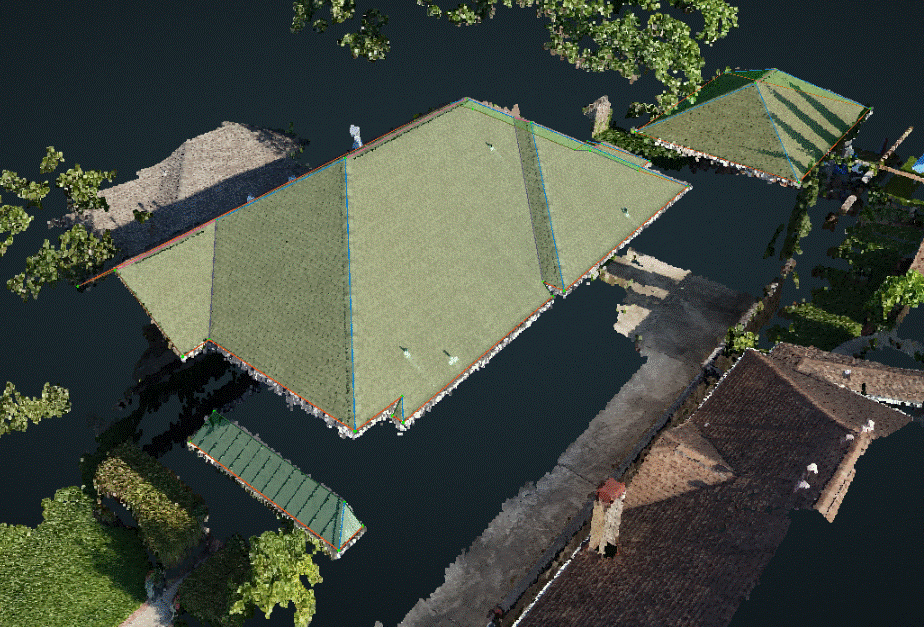
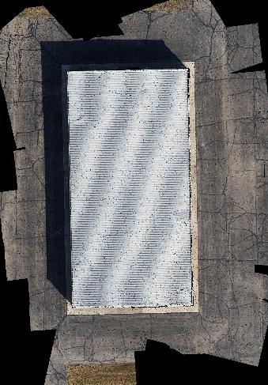
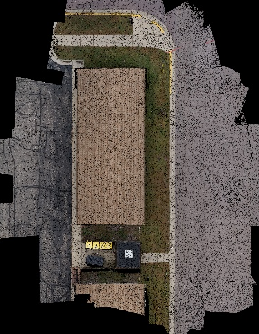
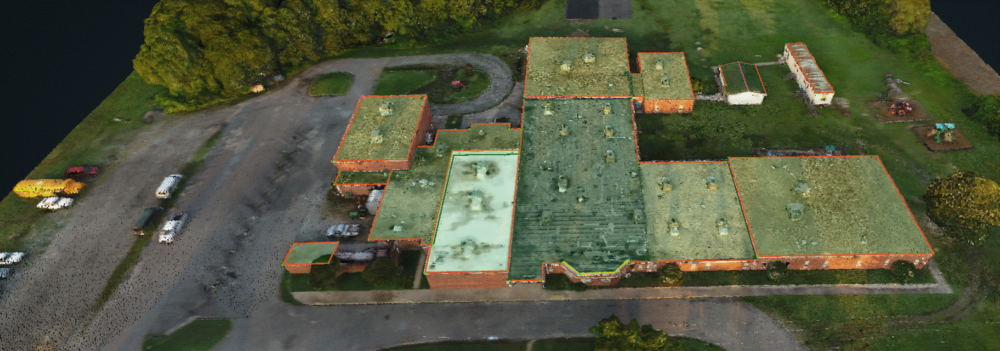
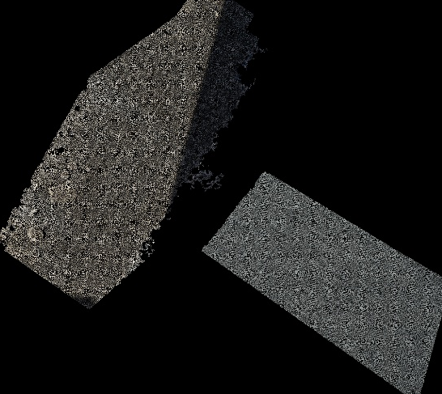
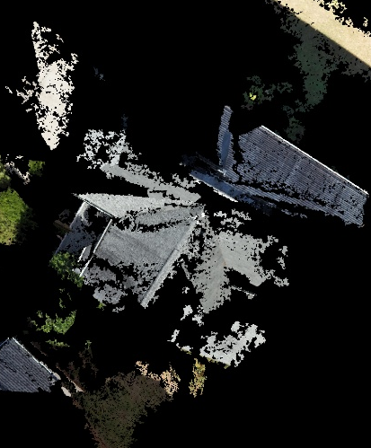
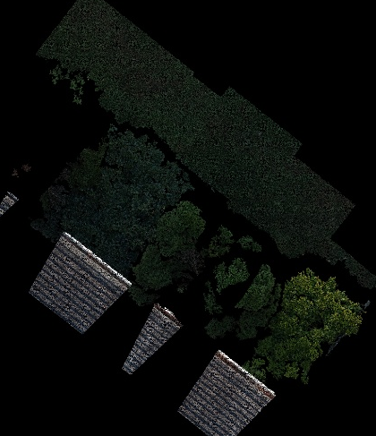

# Structure Types


If you are unsure what type of structure is shown on the cloud, then use Google Maps to look up the address. You will be able to see if the structure is part of a neighborhood or if it's surrounded by a parking lot/spaces. A lot of times commercial structures will already be labeled on the map. 


## Special Cases

Some point clouds will be extremely broken, to the point of being unusable, but you are still able to tell what structure type is being shown. In these cases, you would select the structure type that it should be if it wasn't broken. Examples below:

## SINGLEFAMILY

A single structure that houses 1 family. These structures can be small or large \(mansions\), and may have a detached garage or pool house nearby. A good sign for Singlefamily is that they generally only have one driveway. Sometimes they will have a fence around the backyard, or be separated by a privacy fence from the surrounding structures.

## MULTIFAMILY

A structure that houses more than 1 family. This can be anything from a condominium, or duplex, to a large apartment complex. Look for shared parking areas, multiple balconies/patios, more than 1 backyard. Condos and townhouses may look smaller \(like a singlefamily\), but they will have more than one driveway.


Occasionally there will be a point cloud of a multifamily structure \(like the one above\), but the ROI is only around one individual section/'house' of the structure. In this case the structure type would follow the ROI and become singlefamily instead of multifamily. The ROI would be around a single family portion of the multifamily structure.


## MIXED


IGNORE this type - deprecated


## COMMERCIAL

Factories, churches/cathedrals, hotels, warehouses, restaurants, malls, offices, schools, neighborhood clubhouses, covered picnic areas, parking garages. Look for structures surrounded by a parking lot or with marked parking spaces. Sometimes smaller commercial structures, such as a neighborhood clubhouse, have outdoor seating surrounding it \(picnic tables, several chairs surrounding a pool, etc.\). A lot of large commercial structures will have HVAC units on the roof.

## UNKNOWN

A structure is included but the point cloud of the structure is extremely broken, and the intended structure type is unrecognizable.

## NONE

No structure in the scene or within the Region of Interest.

