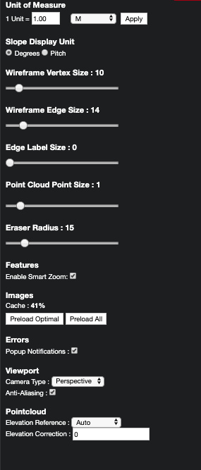

# Settings

Clicking the gear, in the top right corner of the window, opens the Settings menu:

* Unit of Measure:
* Slope Display Unit:
* Wireframe Vertex Size:
* Wireframe Edge Size: 
* Edge Label Size:
* Point Cloud Point Size: 
* Eraser Radius:
* Features: 
  * Enable Smart Zoom: 
* Images: 
  * Preload Optimal: 
  * Preload All:
* Errors: 
  * Popup Notifications: 
* Viewport:
  * Camera Type: 
  * Anti-Aliasing
* Point Cloud: 
  * Elevation Reference: 
  * Elevation Correction: 

