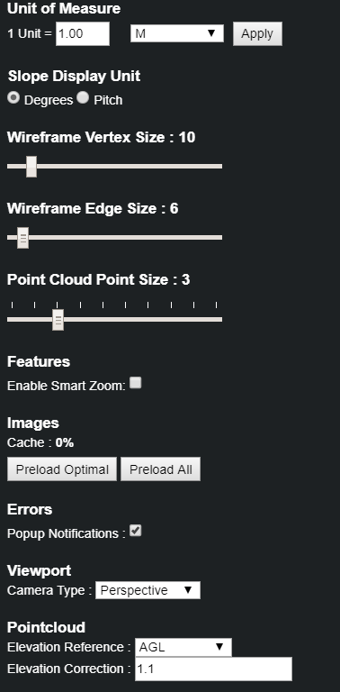

# Settings

Clicking the gear, in the top right corner of the window, opens the Settings menu:

| Setting | Hotkey | Description |
| :--- | :--- | :--- |
| Unit of Measure | none | The dimension units can be set to M, FT, FFI, or Unitless. |
| Slope Display Unit | none | The slope unit can be set to Degrees or Pitch. |
| Wireframe Vertex Size | Ctrl + Scroll in/out | Changes the size of the Vertices. |
| Wireframe Edge Size | Shift + Scroll in/out | Changes the size of the Edges. |
| Edge Label Size | Ctrl + Shift + Scroll in/out | Changes the size of the dimension labels. |
| Point Cloud Point Size | none | Changes the size of the individual points of the point cloud. |
| Eraser Radius | none | Changes the size of the eraser's radius. |
| Features: Enable Smart Zoom | none | Smart Zoom pre-zooms the 2D images for a better starting view without the user zooming in/out. |
| Images: Preload Optimal & All | none | These will preload the optimal 2D images, or all of the 2D images for the project. |
| Errors: Popup Notifications | none | Enables/Disables the error message popups when saving a project. |
| Viewport: Camera Type | none | There's Perspective or Orthographic camera types. The default is Perspective. |
| Viewport: Anti-Aliasing | none |  |
| Pointcloud: Elevation Reference | none |  |
| Pointcloud: Elevation Correction | none |  |

